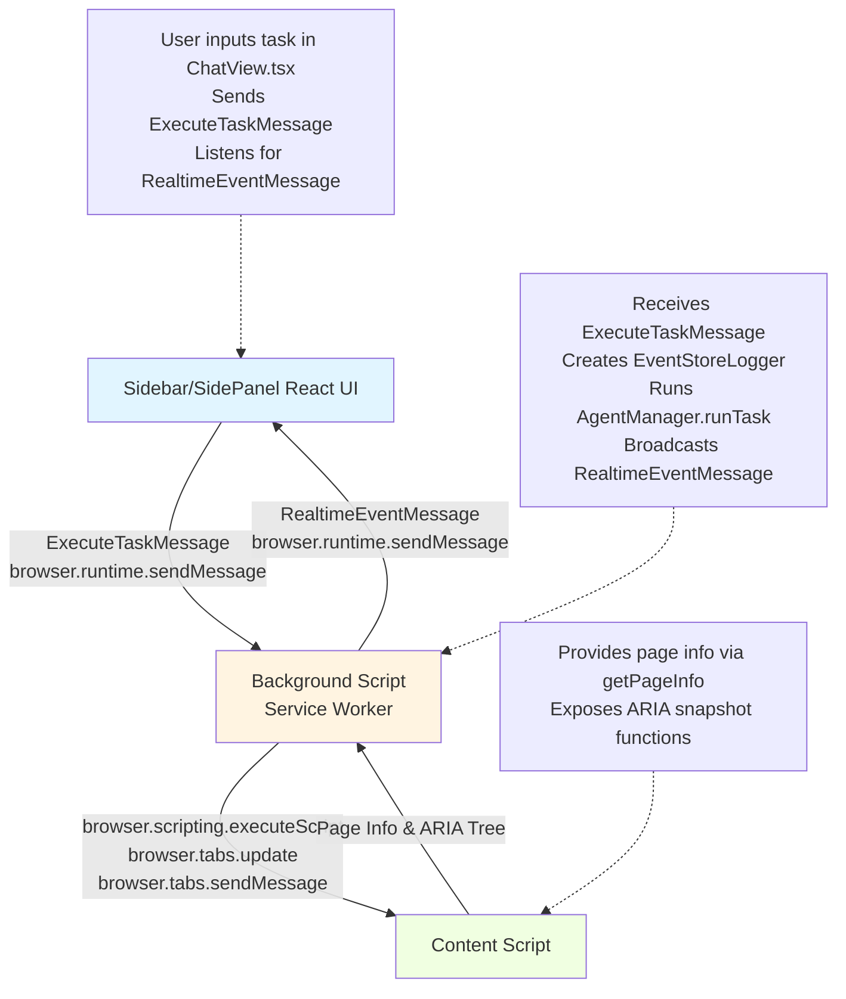
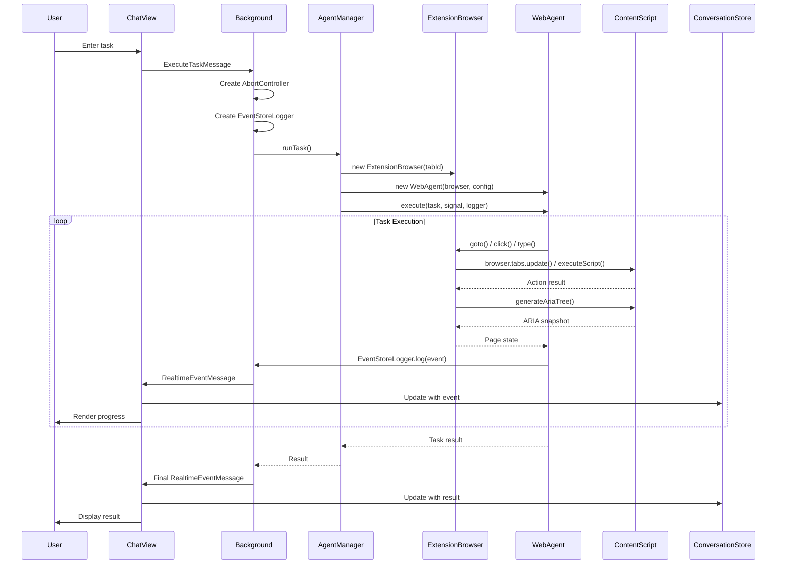
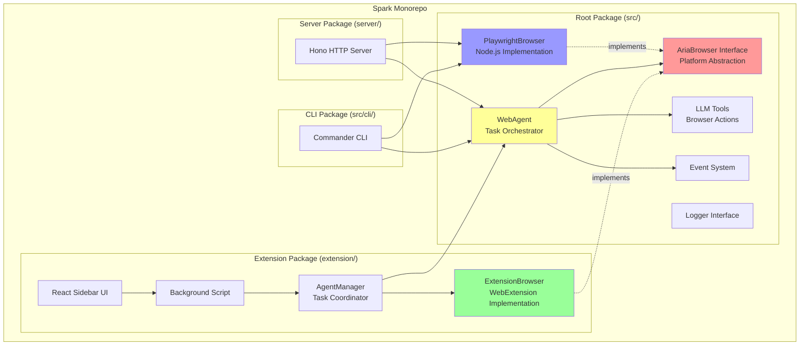
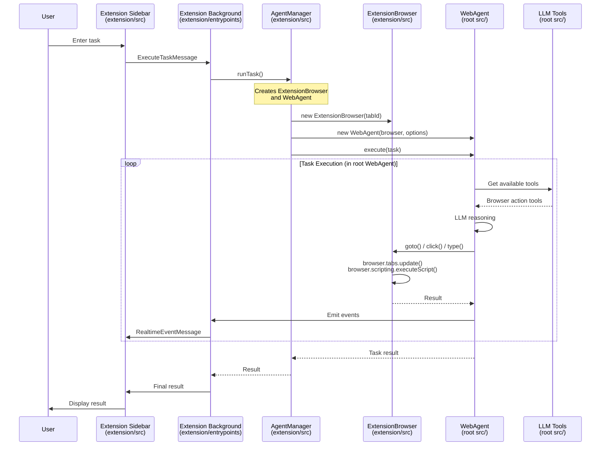

# Spark Browser Extension Architecture

## Overview

Spark is a browser extension that enables AI-powered web automation through natural language tasks. The extension is one of three implementations in the Spark monorepo, all sharing the same core automation logic:

- **Extension** (this package) - Browser extension using WebExtension APIs
- **CLI** - Command-line tool using Playwright
- **Server** - HTTP API server using Playwright

The extension follows the standard WebExtension architecture with three main components:

1. **Background Script (Service Worker)** - Task orchestration and lifecycle management
2. **Content Script** - Page inspection and interaction utilities
3. **Sidebar/SidePanel UI** - React-based user interface for task input and monitoring

## Monorepo Structure

Spark is organized as a PNPM monorepo with three packages:

```
spark/ (root)
├── src/                      # Shared core library
│   ├── webAgent.ts           # Main task orchestrator (used by all)
│   ├── browser/
│   │   ├── ariaBrowser.ts    # Platform-agnostic interface
│   │   └── playwrightBrowser.ts  # Node.js implementation
│   ├── tools/                # LLM tools for browser automation
│   ├── loggers/              # Logger implementations
│   ├── events.ts             # Event emission
│   └── cli/                  # CLI-specific code
├── extension/                # Browser extension (this package)
├── server/                   # HTTP API server
├── package.json              # Root package exports
└── pnpm-workspace.yaml       # Monorepo configuration
```

### Extension Directory Structure

```
extension/
├── entrypoints/              # Extension entry points (WXT framework)
│   ├── background.ts         # Service worker/background script
│   ├── content.ts            # Content script
│   └── sidepanel.html        # Sidebar UI entry point
├── src/
│   ├── components/
│   │   └── sidepanel/        # React UI components
│   │       ├── main.tsx      # React root
│   │       ├── SidePanel.tsx # Main container with routing
│   │       ├── ChatView.tsx  # Chat interface & message handling
│   │       ├── SettingsView.tsx
│   │       └── SidePanel.css
│   ├── stores/               # Zustand state management
│   │   ├── conversationStore.ts   # Per-tab conversation state
│   │   ├── settingsStore.ts       # User settings & credentials
│   │   └── eventStore.ts          # Real-time event logger
│   ├── hooks/                # React custom hooks
│   │   ├── useConversation.ts     # Per-tab conversation management
│   │   └── useAutoScroll.ts       # Auto-scroll for chat messages
│   ├── types/
│   │   └── browser.ts        # Extension message type definitions
│   ├── utils/                # Utility functions
│   │   ├── logger.ts         # Centralized logging
│   │   ├── storage.ts        # Browser storage utilities
│   │   └── typeGuards.ts     # Runtime type validation
│   ├── vendor/               # ARIA snapshot utilities
│   │   ├── ariaSnapshot.ts   # Main ARIA tree generation
│   │   ├── roleUtils.ts      # ARIA role mappings
│   │   ├── domUtils.ts       # DOM manipulation helpers
│   │   ├── yaml.ts           # YAML parsing
│   │   └── @isomorphic/      # Isomorphic utilities
│   │       ├── ariaSnapshot.ts
│   │       ├── cssTokenizer.ts
│   │       └── stringUtils.ts
│   ├── ExtensionBrowser.ts   # Implements AriaBrowser interface (from ../src)
│   ├── AgentManager.ts       # Wraps WebAgent from shared core
│   ├── EventStoreLogger.ts   # Event broadcaster
│   ├── EventLogger.ts        # Base event logger
│   ├── ChatMessage.tsx       # Individual message component
│   ├── theme.ts              # Light/dark theme configuration
│   ├── useChat.ts            # DEPRECATED: Legacy composite hook
│   ├── useEventLogger.ts     # Hook for event logger access
│   ├── useEventStore.ts      # Hook for event store access
│   └── useSystemTheme.ts     # System theme detection hook
├── test/                     # Vitest test suite
│   ├── setup.ts              # Test configuration
│   ├── background.test.ts
│   ├── AgentManager.test.ts
│   ├── EventStoreLogger.test.ts
│   ├── ExtensionBrowser.test.ts
│   ├── ChatMessage.test.tsx
│   ├── components/
│   │   ├── SettingsView.test.tsx
│   │   └── sidepanel/
│   │       └── ChatView.test.tsx
│   ├── stores/
│   │   └── settingsStore.test.ts
│   └── utils/
│       ├── storage.test.ts
│       └── typeGuards.test.ts
├── wxt.config.ts            # WXT framework configuration
├── vitest.config.ts         # Test runner configuration
└── package.json             # Dependencies: "spark": "file:.."
```

## Core Components

### Background Script (Service Worker)

**Location**: [entrypoints/background.ts](../entrypoints/background.ts)

The background script runs in a service worker context and serves as the main orchestrator for the extension.

**Responsibilities**:

- Handles sidebar open/close via toolbar button clicks
- Receives task execution requests from the sidebar
- Manages task execution lifecycle with `AbortController` per tab
- Coordinates between content scripts and sidebar
- Broadcasts real-time events during task execution
- Cleans up resources when tabs are closed

**Key Message Handlers**:

```typescript
// Listen for task execution requests from sidebar
browser.runtime.onMessage.addListener((message: ExecuteTaskMessage) => {
  // Create AbortController to track and cancel task
  // Create EventStoreLogger to broadcast events
  // Call AgentManager.runTask() to execute
});

// Listen for task cancellation requests
browser.runtime.onMessage.addListener((message: CancelTaskMessage) => {
  // Abort the task via AbortController
});

// Clean up when tabs close
browser.tabs.onRemoved.addListener((tabId) => {
  // Cancel running tasks
  // Clean up resources
});
```

**Task Tracking**:

- Maintains a map of `tabId -> AbortController` for running tasks
- Each task can be cancelled independently
- Automatic cleanup on tab removal

### Content Script

**Location**: [entrypoints/content.ts](../entrypoints/content.ts)

The content script is injected into every web page and provides page inspection capabilities.

**Responsibilities**:

- Exposes ARIA tree generation utilities globally
- Provides page information (title, URL) to background script
- Makes page state inspectable for agents

**Global Functions Exposed**:

```typescript
window.generateAriaTree = generateAriaTree; // Generate ARIA snapshot
window.renderAriaTree = renderAriaTree; // Render ARIA tree as text
```

**Message Handlers**:

```typescript
browser.runtime.onMessage.addListener((message): Promise<{ title: string; url: string }> => {
  if (message.type === "getPageInfo") {
    return Promise.resolve({
      title: document.title,
      url: window.location.href,
    });
  }
});
```

**Key Utilities**:

- ARIA tree generation from [vendor/ariaSnapshot.ts](../src/vendor/ariaSnapshot.ts)
- ARIA role mappings from [vendor/roleUtils.ts](../src/vendor/roleUtils.ts) (52 KB database)
- DOM utilities from [vendor/domUtils.ts](../src/vendor/domUtils.ts)
- YAML support from [vendor/yaml.ts](../src/vendor/yaml.ts)
- Isomorphic utilities from [vendor/@isomorphic/](../src/vendor/@isomorphic/)
  - Alternative ARIA snapshot implementation
  - CSS tokenization utilities
  - String manipulation helpers
- Provides accessibility tree representation of page structure
- Used by agents to understand page state

### Visual Indicator System

**Location**: [src/background/indicatorControl.ts](../src/background/indicatorControl.ts)

The extension displays a visual indicator (purple glow border) on pages during active task execution. This system uses dynamic CSS registration to reduce flash during navigation.

**Architecture**:

```
┌─────────────────────────────────────────────────────────────────┐
│                     FIRST TAB STARTS TASK                       │
│                                                                  │
│  1. registerContentScripts() with CSS + runAt: "document_start" │
│     (single registration: id="spark-indicator")                 │
│  2. Increment activeIndicators count                            │
│  3. insertCSS() for current page (already loaded)               │
│  4. executeScript() to add class on current page                │
└─────────────────────────────────────────────────────────────────┘
                              │
                              ▼
┌─────────────────────────────────────────────────────────────────┐
│                     NAVIGATION DURING TASK                       │
│                                                                  │
│  CSS auto-injected at document_start (before DOM renders)       │
│  executeScript() adds class (via onCommitted listener)          │
│  Result: Reduced flash - CSS already present when class added   │
└─────────────────────────────────────────────────────────────────┘
                              │
                              ▼
┌─────────────────────────────────────────────────────────────────┐
│                     TASK ENDS (or tab closes)                    │
│                                                                  │
│  1. executeScript() to remove class from current page           │
│  2. removeCSS() from current page                               │
│  3. Decrement activeIndicators count                            │
│  4. If count == 0: unregisterContentScripts()                   │
└─────────────────────────────────────────────────────────────────┘
```

**Key Components**:

1. **Dynamic CSS Registration**: Uses `chrome.scripting.registerContentScripts()` to register CSS at `document_start` for all URLs when a task starts. This ensures CSS is present before the DOM renders on navigation.

2. **Reference Counting**: A single shared registration (`id: "spark-indicator"`) is used with reference counting via `activeIndicators` Set. CSS is only unregistered when no tabs have active indicators.

3. **Class Toggle**: The indicator is activated/deactivated by adding/removing `spark-indicator-active` class from `<html>` element.

4. **Navigation Handling**:
   - `webNavigation.onCommitted` listener re-applies class on early navigation
   - `tabs.onUpdated` listener provides fallback on page complete
   - CSS is already present via registered content script

5. **Cleanup**: `cleanupStaleRegistrations()` runs on startup to remove orphaned registrations from previous sessions (e.g., after crash).

**CSS File**: [public/indicator.css](../public/indicator.css) - Standalone CSS file copied to build output root, used by `registerContentScripts`.

**Why This Approach**:

- **Reduced Flash**: Pre-registered CSS eliminates CSS injection latency during navigation
- **Shared Registration**: Single registration prevents duplicate CSS on pages with multiple indicator tabs
- **Graceful Degradation**: Tab closure and extension restart are handled cleanly

### Sidebar/SidePanel UI

**Location**: [src/components/sidepanel/](../src/components/sidepanel/)

React-based user interface that provides the main interaction point for users.

**Main Components**:

1. **[SidePanel.tsx](../src/components/sidepanel/SidePanel.tsx)** - Root container
   - Handles routing between Chat and Settings views
   - Manages active tab tracking
   - Provides navigation UI

2. **[ChatView.tsx](../src/components/sidepanel/ChatView.tsx)** - Task interface
   - Task input form
   - Message history display
   - Real-time event rendering (plan, reasoning, status updates)
   - Task execution controls (submit, cancel)

3. **[SettingsView.tsx](../src/components/sidepanel/SettingsView.tsx)** - Configuration
   - API credentials (key, endpoint, model)
   - Provider selection
   - Settings persistence

**Event Flow**:

```typescript
// Send task to background script
browser.runtime.sendMessage({
  type: "executeTask",
  task: userInput,
  tabId: activeTab,
  apiKey,
  apiEndpoint,
  model,
});

// Listen for real-time events
browser.runtime.onMessage.addListener((message: RealtimeEventMessage) => {
  // Update conversation store with events
  // Re-render UI with new events
});
```

## Message Passing Architecture

The extension uses the standard WebExtension message passing API for inter-component communication.



### Message Types

**Location**: [src/types/browser.ts](../src/types/browser.ts)

**ExecuteTaskMessage** - Sidebar → Background

```typescript
{
  type: "executeTask",
  task: string,              // Natural language task description
  tabId?: number,           // Target browser tab
  data?: any,              // Additional context (URL, etc.)
  apiKey: string,          // AI provider credentials
  apiEndpoint?: string,
  model: string
}
```

**CancelTaskMessage** - Sidebar → Background

```typescript
{
  type: "cancelTask",
  tabId?: number           // Tab with task to cancel
}
```

**RealtimeEventMessage** - Background → Sidebar

```typescript
{
  type: "realtimeEvent",
  event: RealtimeEvent     // Event data with type and payload
}
```

**Event Types**:

- `task:started` - Task begins with execution plan
- `agent:reasoned` - Agent's internal reasoning steps
- `agent:status` - Current status updates
- `ai:generation:error` - AI API errors
- `task:validation_error` - Task validation failures
- `browser:action:completed` - Browser automation action results

## Task Execution Flow



### AgentManager

**Location**: [src/AgentManager.ts](../src/AgentManager.ts)

Coordinates task execution between the extension and the core Spark agent.

**Key Responsibilities**:

- Creates `ExtensionBrowser` instance for the target tab
- Initializes `WebAgent` from spark/core with AI configuration
- Manages agent execution lifecycle
- Handles cancellation via `AbortSignal`
- Captures and broadcasts events via `EventStoreLogger`

**Execution Flow**:

```typescript
async runTask(params: ExecuteTaskParams, signal?: AbortSignal) {
  // Create browser instance for this tab
  const browser = new ExtensionBrowser(params.tabId);

  // Create event logger that broadcasts to sidebar
  const logger = new EventStoreLogger();

  // Initialize agent with AI configuration
  const agent = new WebAgent(browser, {
    apiKey: params.apiKey,
    model: params.model,
    endpoint: params.apiEndpoint
  });

  // Execute task with cancellation support
  const result = await agent.execute(params.task, { signal, logger });

  return result;
}
```

### ExtensionBrowser

**Location**: [src/ExtensionBrowser.ts](../src/ExtensionBrowser.ts)

Adapts WebExtension APIs to implement the `AriaBrowser` interface from spark/core. This allows the same agent code to run in extension, CLI, and server contexts.

**Key Methods**:

```typescript
class ExtensionBrowser implements AriaBrowser {
  // Navigate to URL
  async goto(url: string): Promise<void> {
    await browser.tabs.update(this.tabId, { url });
  }

  // Execute JavaScript in page context
  async evaluate(script: string): Promise<any> {
    const results = await browser.scripting.executeScript({
      target: { tabId: this.tabId },
      func: new Function(script),
    });
    return results[0].result;
  }

  // Get page ARIA snapshot
  async snapshot(): Promise<AriaTree> {
    const results = await browser.scripting.executeScript({
      target: { tabId: this.tabId },
      func: () => window.generateAriaTree(),
    });
    return results[0].result;
  }

  // Interact with elements (click, type, etc.)
  async click(selector: string): Promise<void> {
    /* ... */
  }
  async type(selector: string, text: string): Promise<void> {
    /* ... */
  }
  // ... other interaction methods
}
```

**Browser Abstraction Benefits**:

- Same agent logic works across extension, CLI, and server
- Easy to test with different browser implementations
- Clean separation of concerns between agent logic and browser APIs

### EventStoreLogger

**Location**: [src/EventStoreLogger.ts](../src/EventStoreLogger.ts)

Captures events during task execution and broadcasts them to the sidebar for real-time UI updates.

**Key Features**:

- Implements the `EventLogger` interface from spark/core
- Broadcasts events via `browser.runtime.sendMessage()`
- All extension listeners receive events simultaneously
- Non-blocking - doesn't slow down task execution

**Event Broadcasting**:

```typescript
class EventStoreLogger implements EventLogger {
  log(type: string, data: any): void {
    browser.runtime.sendMessage({
      type: "realtimeEvent",
      event: { type, data, timestamp: Date.now() },
    });
  }
}
```

## React Hooks Architecture

The extension uses custom React hooks to provide clean interfaces to stores and system APIs.

### Core Hooks

**Location**: [src/hooks/](../src/hooks/)

#### useConversation

**Location**: [src/hooks/useConversation.ts](../src/hooks/useConversation.ts)

Provides a clean interface to the conversation store for a specific tab.

**Purpose**:

- Manages per-tab conversation state
- Provides message management actions
- Handles task lifecycle (start/end)
- Tracks execution state

**Usage**:

```typescript
const conversation = useConversation(tabId);

// Add messages
conversation.addMessage("user", "Hello!");
conversation.addMessage("assistant", "Hi there!");

// Task management
const taskId = conversation.startTask();
conversation.setExecutionState(true);
// ... task executes ...
conversation.endTask();
conversation.setExecutionState(false);

// Access data
const { messages, currentTaskId, isExecuting } = conversation;
```

**Key Features**:

- Automatic conversation creation for new tabs
- Message type safety with ChatMessage interface
- Task ID generation and tracking
- Execution state management

#### useAutoScroll

**Location**: [src/hooks/useAutoScroll.ts](../src/hooks/useAutoScroll.ts)

Manages auto-scroll behavior in chat interfaces.

**Purpose**:

- Detects scroll position in message list
- Auto-scrolls to bottom for new messages
- Persists scroll state per tab
- Provides smooth scrolling behavior

**Usage**:

```typescript
const autoScroll = useAutoScroll(messages, tabId);

return (
  <div ref={autoScroll.scrollContainerRef} onScroll={autoScroll.handleScroll}>
    {messages.map(msg => <ChatMessage key={msg.id} {...msg} />)}
    <div ref={autoScroll.messagesEndRef} />
  </div>
);
```

**Key Features**:

- Sticky scroll - stays at bottom when new messages arrive
- Detects manual scroll away from bottom
- Instant scroll on tab switch
- Smooth scroll for new messages

### Additional Hooks

**Location**: [src/](../src/) (root level)

- **[useEventLogger.ts](../src/useEventLogger.ts)** - Access to event logger instance
- **[useEventStore.ts](../src/useEventStore.ts)** - Access to event store
- **[useSystemTheme.ts](../src/useSystemTheme.ts)** - Detects system theme preference (light/dark)
- **[useChat.ts](../src/useChat.ts)** - DEPRECATED: Legacy composite hook combining useConversation and useAutoScroll

## UI Components

### ChatMessage Component

**Location**: [src/ChatMessage.tsx](../src/ChatMessage.tsx)

Renders individual chat messages with proper styling and content formatting.

**Features**:

- Message type differentiation (user, assistant, system, reasoning, etc.)
- Simple markdown rendering (bold text with `**text**`)
- Streaming indicator for in-progress messages
- Reasoning steps display during agent thinking
- Timestamp formatting
- Theme-aware styling

**Usage**:

```typescript
<ChatMessage
  type="assistant"
  content="Task completed successfully"
  timestamp={new Date()}
  theme={currentTheme}
  isStreaming={false}
/>
```

## Theme System

**Location**: [src/theme.ts](../src/theme.ts)

Comprehensive theme configuration supporting light and dark modes.

**Structure**:

```typescript
export const theme = {
  typography: { size, weight, leading },
  spacing: { padding, margin, gap },
  layout: { maxWidth, rounded, overflow, display, flex },
  utilities: { textAlign, whitespace, transition, cursor, opacity, focus },
  light: { bg, text, border, hover, events },
  dark: { bg, text, border, hover, events },
};
```

**Key Features**:

- Tailwind CSS class organization
- Light and dark mode color schemes
- Event-specific colors for different log types
- Typography and spacing system
- Layout utilities
- Focus and interaction states

**Color Philosophy**:

- **Light Mode**: Light backgrounds with dark text
- **Dark Mode**: Dark sidebar + light panel with dark text (maintains readability)
- **Event Colors**: Semantic colors for different event types (task, plan, action, success, error, etc.)

## CSS Architecture

The extension uses a modern CSS-first architecture built on Tailwind CSS.

### Technology Stack

- **Tailwind CSS** - Utility-first CSS framework with CSS-based configuration
- **@tailwindcss/vite** - Build integration via Vite plugin
- **@tailwindcss/typography** - Prose styling for markdown content (temporary, see below)

### Single CSS Entry Point

**Location**: [src/components/sidepanel/SidePanel.css](../src/components/sidepanel/SidePanel.css)

All CSS configuration lives in a single file imported by the React app. This file uses Tailwind v4's CSS-first configuration approach—there are no separate `tailwind.config.js` or `postcss.config.js` files.

**Structure**:

```css
/* Base Tailwind import */
@import "tailwindcss";

/* Typography plugin for markdown */
@plugin "@tailwindcss/typography";

/* Custom design tokens via @theme directive */
@theme {
  /* Extended stone color palette and prose chat
     typography variables (font sizes, line heights,
     margins for headings and paragraphs) */
}

/* Semantic component classes */
@layer components {
  .text-message-user {
    /* User message styling */
  }
  .text-message-assistant {
    /* Assistant message styling */
  }
  .markdown-content {
    /* Markdown container */
  }
}

/* Custom prose variant for chat */
@utility prose-chat {
  /* Compact typography for chat messages */
}
```

### Build Integration

**Location**: [wxt.config.ts](../wxt.config.ts)

Tailwind is integrated via the `@tailwindcss/vite` plugin:

```typescript
import tailwindcss from "@tailwindcss/vite";

export default defineConfig({
  vite: () => ({
    plugins: [tailwindcss()],
  }),
});
```

### Custom Color Palette

The extension extends Tailwind's stone color palette with additional shades for finer control:

| Variable            | Hex     | Usage                          |
| ------------------- | ------- | ------------------------------ |
| `--color-stone-25`  | #fdfcfa | Panel backgrounds (light mode) |
| `--color-stone-75`  | #f5f3ef | Message bubbles                |
| `--color-stone-125` | #ebe9e5 | Tertiary backgrounds           |
| `--color-stone-175` | #e5e3df | Borders (light mode)           |
| `--color-stone-225` | #d8d6d2 | Secondary borders              |
| `--color-stone-875` | #2f2f2f | Dark text/elements             |
| `--color-stone-925` | #1c1b22 | Sidebar (dark mode)            |

These are used via theme.ts color mappings and applied with standard Tailwind utilities like `bg-stone-25`.

### Theme Integration

The CSS architecture works in conjunction with [theme.ts](../src/theme.ts):

1. **CSS defines the colors** - Custom palette via `@theme` directive
2. **theme.ts maps semantic names** - `t.bg.panel`, `t.text.primary`, etc.
3. **Components use theme object** - Dynamic class composition with `clsx()`

Example component styling:

<!-- prettier-ignore -->
```tsx
const { theme: t } = useSystemTheme();

<div className={`${t.bg.panel} ${t.text.primary} rounded-lg p-4`}>
  {/* Content */}
</div>;
```

### Semantic CSS Classes

The extension defines semantic classes in the `@layer components` block:

**Message Typography**:

- `.text-message-user` - Sans-serif styling for user messages (system fonts, 0.875rem)
- `.text-message-assistant` - Serif styling for AI responses (Georgia, 1rem) to visually distinguish speakers

**Markdown Rendering**:

- `.markdown-content` - Container that restores HTML list styling (`<ol>`, `<ul>`)
- `.prose-chat` - Custom prose variant with compact spacing for chat context

### Typography Plugin (Temporary)

The `@tailwindcss/typography` plugin provides the `prose` class for markdown rendering. It's used in combination with a custom `prose-chat` utility:

```tsx
<div className="markdown-content prose prose-chat max-w-none">
  <Markdown value={content} />
</div>
```

**Note**: The typography plugin will eventually be discarded in favor of custom CSS that integrates better with the theme system. The custom `prose-chat` utility already demonstrates this direction by providing chat-specific typography variables.

### Future Direction

Several aspects of the current CSS architecture are transitional:

1. **@tailwindcss/typography** - Will be replaced with custom prose styling that integrates with theme.ts color mappings and supports both light/dark modes natively

2. **Semantic message classes** (`text-message-user`, `text-message-assistant`) - Will likely be removed in favor of standard Tailwind utility composition, allowing more flexibility and consistency with the rest of the codebase

The goal is a unified styling system where:

- All colors flow from theme.ts
- Typography uses standard Tailwind utilities
- No plugin dependencies for core styling

## Utility Modules

**Location**: [src/utils/](../src/utils/)

### logger.ts

**Location**: [src/utils/logger.ts](../src/utils/logger.ts)

Centralized logging utility for consistent logging across components.

**Features**:

- Structured logging with context (component, tabId, url)
- Log levels: debug, info, warn, error
- Formatted timestamps
- Development/production mode awareness
- Component-specific logger creation

**Usage**:

```typescript
import { logger, createLogger } from "./utils/logger";

// Direct usage
logger.info("Task started", { component: "Background", tabId: 123 });

// Component-specific logger
const log = createLogger("ChatView");
log.debug("Rendering messages", { count: messages.length });
```

### storage.ts

**Location**: [src/utils/storage.ts](../src/utils/storage.ts)

Browser storage utilities for JSON serialization/deserialization.

**Key Function**:

```typescript
export function reviver(key: string, value: unknown): unknown;
```

- Converts ISO date strings to Date objects for 'timestamp' keys
- Used with `JSON.parse()` and Zustand's `createJSONStorage`
- Handles both string and number timestamp formats

### typeGuards.ts

**Location**: [src/utils/typeGuards.ts](../src/utils/typeGuards.ts)

Runtime type validation for extension messages and data structures.

**Features**:

- Type guards for ExtensionMessage types
- RealtimeEvent validation
- Safe type narrowing for message handling
- Prevents runtime type errors

## State Management

The extension uses Zustand for state management with localStorage persistence.

### Conversation Store

**Location**: [src/stores/conversationStore.ts](../src/stores/conversationStore.ts)

Manages per-tab conversation state with persistence.

**State Structure**:

```typescript
{
  conversations: Record<string, Conversation>;
}

type Conversation = {
  tabId: string;
  messages: Message[]; // Task history and results
  currentTaskId: string | null; // Currently executing task
  isExecuting: boolean; // Execution status
};
```

**Key Features**:

- Each browser tab has its own conversation
- Messages persist across extension reloads
- Tracks execution state per tab
- Automatic cleanup of old conversations

### Settings Store

**Location**: [src/stores/settingsStore.ts](../src/stores/settingsStore.ts)

Manages user configuration and AI provider credentials.

**State Structure**:

```typescript
{
  apiKey: string,
  apiEndpoint?: string,
  model: string,
  provider: "openai" | "anthropic" | "custom"
}
```

**Key Features**:

- Persisted in `browser.storage.local`
- Secure credential storage
- Cross-browser compatibility
- Automatic sync across extension pages

### Event Store

**Location**: [src/stores/eventStore.ts](../src/stores/eventStore.ts)

Tracks real-time events for debugging and monitoring.

**State Structure**:

```typescript
{
  events: EventData[],
  maxEvents: number  // Limit to prevent memory issues
}
```

**Event Types Tracked**:

- Task lifecycle events (started, completed, failed)
- Agent reasoning and status updates
- Browser actions and results
- Errors and validation failures

## Browser Compatibility

The extension supports both Chrome (Manifest V3) and Firefox (Manifest V2) through WXT's multi-browser build system.

### Manifest Configuration

**Location**: [wxt.config.ts](../wxt.config.ts)

**Chrome (Manifest V3)**:

```json
{
  "manifest_version": 3,
  "background": {
    "service_worker": "background.js"
  },
  "side_panel": {
    "default_path": "sidepanel.html"
  }
}
```

**Firefox (Manifest V2)**:

```json
{
  "manifest_version": 2,
  "background": {
    "scripts": ["background.js"]
  },
  "sidebar_action": {
    "default_panel": "sidepanel.html"
  }
}
```

### Cross-Browser APIs

The extension uses `webextension-polyfill` for consistent API across browsers:

- `browser.runtime.*` - Message passing
- `browser.tabs.*` - Tab management
- `browser.scripting.*` - Content script injection
- `browser.storage.*` - Data persistence
- `browser.sidePanel.*` (Chrome) / `browser.sidebarAction.*` (Firefox) - Sidebar

## Technology Stack

- **Build Tool**: WXT (WebExtension development framework)
- **UI Framework**: React 19 with TypeScript
- **State Management**: Zustand with persistence middleware
- **Storage**: browser.storage.local (cross-browser)
- **Styling**: Tailwind CSS
- **Markdown Rendering**: marked-react (with XSS protection)
- **Web Extension API**: webextension-polyfill
- **Agent Core**: spark/core (shared with CLI and server)

## Relationship to Core Codebase

The extension is part of a monorepo and depends heavily on shared code from the root `src/` directory. Understanding this relationship is crucial for working with the codebase.

### Core Abstractions

The extension implements platform-specific versions of core abstractions defined in the root package:

#### AriaBrowser Interface

**Location**: [../../src/browser/ariaBrowser.ts](../../src/browser/ariaBrowser.ts)

The `AriaBrowser` interface is the key abstraction that enables the same agent logic to run across different platforms:

```typescript
export interface AriaBrowser {
  browserName: string;
  start(): Promise<void>;
  shutdown(): Promise<void>;
  goto(url: string): Promise<void>;
  goBack(): Promise<void>;
  goForward(): Promise<void>;
  getUrl(): Promise<string>;
  getTitle(): Promise<string>;
  getTreeWithRefs(): Promise<string>; // Accessibility tree
  getMarkdown(): Promise<string>; // Page content as markdown
  getScreenshot(): Promise<Buffer>;
  performAction(ref: string, action: PageAction, value?: string): Promise<void>;
  waitForLoadState(state: LoadState, options?: { timeout?: number }): Promise<void>;
}
```

**Implementations**:

1. **PlaywrightBrowser** ([../../src/browser/playwrightBrowser.ts](../../src/browser/playwrightBrowser.ts))
   - Used by CLI and Server
   - Uses Playwright library for browser automation
   - Runs in Node.js environment

2. **ExtensionBrowser** ([src/ExtensionBrowser.ts](../src/ExtensionBrowser.ts))
   - Used by the extension
   - Uses WebExtension APIs (`browser.tabs.*`, `browser.scripting.*`)
   - Runs in browser extension context

#### WebAgent Class

**Location**: [../../src/webAgent.ts](../../src/webAgent.ts)

The `WebAgent` class contains the core task execution logic that is shared across all implementations:

```typescript
export class WebAgent {
  constructor(
    browser: AriaBrowser, // Any implementation works
    options: WebAgentOptions,
  );

  async execute(task: string, options?: ExecuteOptions): Promise<TaskExecutionResult>;
}
```

**How the Extension Uses It**:

```typescript
// extension/src/AgentManager.ts
import { WebAgent } from "spark/core";
import { ExtensionBrowser } from "./ExtensionBrowser";

class AgentManager {
  static async runTask(params: ExecuteTaskParams) {
    // Create extension-specific browser implementation
    const browser = new ExtensionBrowser(params.tabId);

    // Use shared WebAgent with extension browser
    const agent = new WebAgent(browser, {
      providerConfig: { model: params.model },
      logger: params.logger,
    });

    // Execute task - same logic as CLI/Server
    return agent.execute(params.task, {
      data: params.data,
      signal: params.signal,
    });
  }
}
```

### Package Dependencies

The extension declares a local file dependency on the root package:

**extension/package.json**:

```json
{
  "dependencies": {
    "spark": "file:..", // Points to root package
    "react": "^19.2.0",
    "zustand": "^5.0.8",
    "webextension-polyfill": "^0.12.0"
  }
}
```

This allows importing from two entry points:

1. **`spark/core`** - Browser-safe exports (used by extension)
   - WebAgent, AriaBrowser interface, Events, Loggers
   - No Node.js dependencies
   - Safe for browser extension environment

2. **`spark`** - Full exports including Node.js APIs (used by CLI/Server)
   - Everything from `spark/core` plus:
   - PlaywrightBrowser, config utilities, Node.js-specific loggers

### Shared Components

The following are imported from the root package and used directly:

**From [../../src/events.ts](../../src/events.ts)**:

```typescript
import { WebAgentEventEmitter } from "spark/core";
// Used for event emission during task execution
```

**From [../../src/loggers/types.ts](../../src/loggers/types.ts)**:

```typescript
import { Logger } from "spark/core";
// EventStoreLogger extends GenericLogger
```

**From [../../src/schemas.ts](../../src/schemas.ts)**:

```typescript
import { PageAction, LoadState } from "spark/core";
// Used by ExtensionBrowser for action types
```

### Architecture Diagram: Extension in Monorepo Context



### Key Files from Root Package

These files in the root `src/` directory are crucial to understanding how the extension works:

| File                                                                             | Purpose                                     | Used By Extension                      |
| -------------------------------------------------------------------------------- | ------------------------------------------- | -------------------------------------- |
| [../../src/webAgent.ts](../../src/webAgent.ts)                                   | Main task orchestrator with LLM integration | Yes - via AgentManager                 |
| [../../src/browser/ariaBrowser.ts](../../src/browser/ariaBrowser.ts)             | Platform-agnostic browser interface         | Yes - ExtensionBrowser implements this |
| [../../src/browser/playwrightBrowser.ts](../../src/browser/playwrightBrowser.ts) | Node.js browser implementation              | No - Extension has own implementation  |
| [../../src/tools/webActionTools.ts](../../src/tools/webActionTools.ts)           | LLM tools for browser actions               | Indirectly via WebAgent                |
| [../../src/events.ts](../../src/events.ts)                                       | Event emission system                       | Yes - for real-time updates            |
| [../../src/loggers/generic.ts](../../src/loggers/generic.ts)                     | Base logger implementation                  | Yes - EventStoreLogger extends this    |
| [../../src/schemas.ts](../../src/schemas.ts)                                     | Type definitions and validation             | Yes - for PageAction, LoadState, etc.  |
| [../../src/prompts.ts](../../src/prompts.ts)                                     | System prompts for LLM                      | Indirectly via WebAgent                |

### Execution Flow Across Packages



### Why This Architecture?

This monorepo architecture provides several benefits:

1. **Code Reuse**: Core automation logic (WebAgent) is written once, used everywhere
2. **Consistent Behavior**: All implementations execute tasks the same way
3. **Easy Testing**: Mock implementations of AriaBrowser can be created for testing
4. **Platform Independence**: WebAgent doesn't know or care about the browser implementation
5. **Separate Concerns**: Extension code focuses on WebExtension APIs, core focuses on automation logic

### Development Implications

When working on the extension:

- **For UI changes**: Work only in `extension/src/components/`
- **For extension-specific APIs**: Work in `extension/src/ExtensionBrowser.ts`
- **For task execution logic**: Changes go in root `src/webAgent.ts` (affects all implementations)
- **For browser actions**: Changes go in root `src/tools/` (affects all implementations)
- **For event handling**: Changes in root `src/events.ts` affect extension's event system

## Key Design Patterns

### 1. Browser Abstraction

The `ExtensionBrowser` class abstracts WebExtension APIs behind the `AriaBrowser` interface, enabling:

- Code reuse across extension, CLI, and server
- Easy testing with mock implementations
- Clean separation of agent logic from browser APIs

### 2. Event Broadcasting

Real-time events flow from background script to sidebar through message passing:

- `EventStoreLogger` captures events during execution
- Events broadcast via `browser.runtime.sendMessage()`
- Sidebar receives and renders events immediately
- Non-blocking - doesn't impact task performance

### 3. Task Cancellation

Tasks can be cancelled via `AbortController`:

- Background tracks running tasks per tab
- `CancelTaskMessage` triggers `controller.abort()`
- `AbortSignal` propagates through agent execution
- Resources cleaned up on cancellation

### 4. Per-Tab Isolation

Each browser tab maintains independent state:

- Separate conversation history
- Independent task execution
- No cross-tab interference
- Automatic cleanup on tab close

### 5. Persistence

State persists across extension reloads:

- Conversations stored in localStorage
- Settings stored in browser.storage.local
- Automatic rehydration on startup
- Cross-browser compatibility

## Security Considerations

### Content Security Policy

The extension follows strict CSP guidelines:

- No inline scripts in HTML
- No `eval()` or `new Function()` in content scripts
- All code bundled at build time

### Credential Storage

- API keys stored in `browser.storage.local` (encrypted by browser)
- Never exposed to content scripts
- Only accessible to background script and sidebar
- Cleared on extension uninstall

### XSS Prevention

- Markdown rendering uses `marked-react` with sanitization
- User input escaped before display
- No `dangerouslySetInnerHTML` usage
- Content scripts isolated from page scripts

### Permissions

The extension requests minimal permissions:

- `activeTab` - Only access current tab
- `scripting` - Inject content scripts
- `storage` - Persist settings
- `tabs` - Manage tab lifecycle
- `sidePanel` / `sidebarAction` - Sidebar UI

## Testing Architecture

**Location**: [test/](../test/)

The extension uses Vitest for unit and integration testing.

### Test Configuration

- **[vitest.config.ts](../vitest.config.ts)** - Vitest configuration with browser environment
- **[test/setup.ts](../test/setup.ts)** - Test setup with webextension-polyfill mocks

### Test Structure

**Core Component Tests**:

- [test/background.test.ts](../test/background.test.ts) - Background script message handling
- [test/AgentManager.test.ts](../test/AgentManager.test.ts) - Task execution coordinator
- [test/EventStoreLogger.test.ts](../test/EventStoreLogger.test.ts) - Event broadcasting
- [test/ExtensionBrowser.test.ts](../test/ExtensionBrowser.test.ts) - Browser abstraction

**UI Component Tests**:

- [test/ChatMessage.test.tsx](../test/ChatMessage.test.tsx) - Message rendering
- [test/components/SettingsView.test.tsx](../test/components/SettingsView.test.tsx) - Settings UI
- [test/components/sidepanel/ChatView.test.tsx](../test/components/sidepanel/ChatView.test.tsx) - Chat interface

**Store Tests**:

- [test/stores/settingsStore.test.ts](../test/stores/settingsStore.test.ts) - Settings persistence

**Utility Tests**:

- [test/utils/storage.test.ts](../test/utils/storage.test.ts) - Storage helpers
- [test/utils/typeGuards.test.ts](../test/utils/typeGuards.test.ts) - Type validation

### Testing Strategy

The extension follows Test-Driven Development (TDD) principles:

1. **Unit Tests** - Test individual components in isolation
2. **Integration Tests** - Test message passing between components
3. **Mock WebExtension APIs** - Use webextension-polyfill mocks
4. **Type Safety** - Validate runtime type guards
5. **Browser Abstraction** - Test ExtensionBrowser independently of WebExtension APIs

**Test Commands**:

```bash
# Quick test iteration (Red/Green phases)
pnpm test

# Watch mode for TDD
pnpm test -- --watch

# Coverage report
pnpm test -- --coverage

# Run specific test file
pnpm test ExtensionBrowser.test.ts
```

## Development Workflow

### Running the Extension

```bash
# Development mode with hot reload
pnpm dev

# Build for production
pnpm build

# Build for specific browser
pnpm build:chrome
pnpm build:firefox
```

### Testing

```bash
# Run unit tests (fast TDD iteration)
pnpm test

# Run comprehensive validation (formatting, type checking, tests)
pnpm check

# Type checking only
pnpm typecheck

# Format code
pnpm format
```

### Project Structure Guidelines

- **Entry points** in `entrypoints/` - Background, content, sidebar
- **UI components** in `src/components/` - React components
- **State management** in `src/stores/` - Zustand stores
- **Type definitions** in `src/types/` - TypeScript types
- **Business logic** in `src/` - Core extension logic
- **Configuration** in root - WXT config, package.json

## Future Considerations

### Potential Enhancements

1. **Multi-tab coordination** - Tasks that span multiple tabs
2. **Persistent sessions** - Resume tasks after extension reload
3. **Task history** - Search and replay previous tasks
4. **Performance monitoring** - Track task execution time
5. **Custom actions** - User-defined automation actions
6. **Export/import** - Share conversations and settings

### Scalability

The current architecture scales well for:

- Multiple concurrent tasks (per-tab isolation)
- Large conversation histories (pagination possible)
- Many browser tabs (independent state)
- Complex task execution (event streaming)

### Limitations

- Service worker lifetime - May need to persist state externally
- Content script injection - Requires host permissions
- ARIA tree size - May need chunking for large pages
- Message size limits - May need streaming for large data

## Additional Resources

### Extension-Specific

- **Extension README**: [../README.md](../README.md)
- **WXT Documentation**: https://wxt.dev/
- **WebExtension API**: https://developer.mozilla.org/en-US/docs/Mozilla/Add-ons/WebExtensions

### Shared Core Code

- **Root Package README**: [../../README.md](../../README.md)
- **WebAgent Source**: [../../src/webAgent.ts](../../src/webAgent.ts)
- **AriaBrowser Interface**: [../../src/browser/ariaBrowser.ts](../../src/browser/ariaBrowser.ts)
- **PlaywrightBrowser Implementation**: [../../src/browser/playwrightBrowser.ts](../../src/browser/playwrightBrowser.ts)
- **LLM Tools**: [../../src/tools/](../../src/tools/)
- **Event System**: [../../src/events.ts](../../src/events.ts)

### Other Implementations

- **CLI Source**: [../../src/cli/](../../src/cli/)
- **Server Source**: [../../server/](../../server/)
