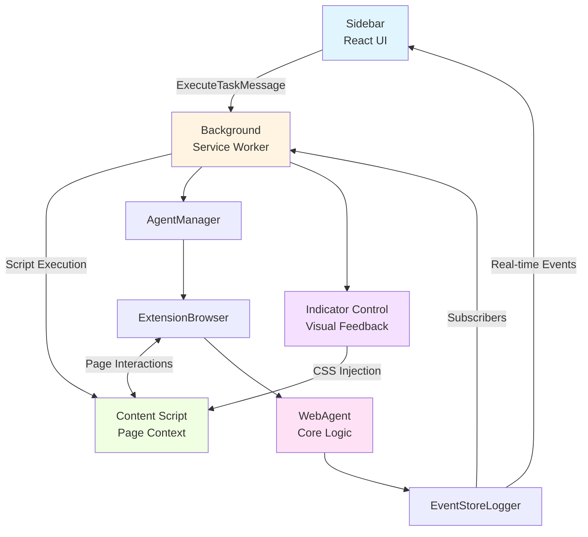
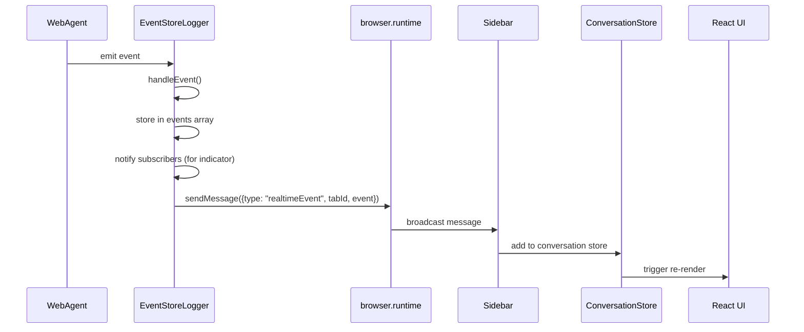
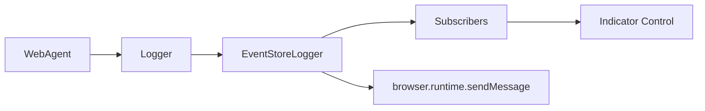
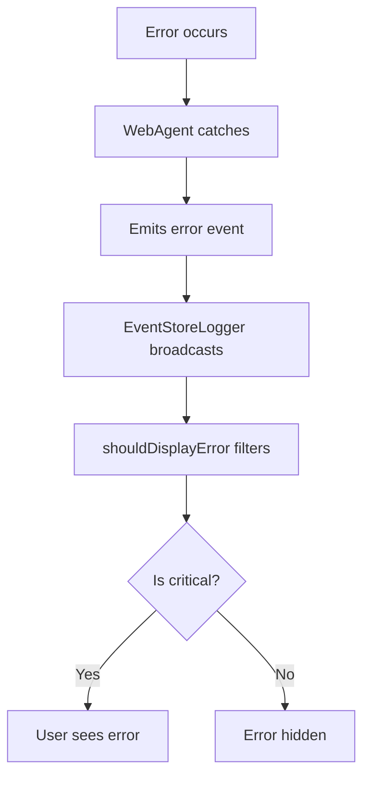
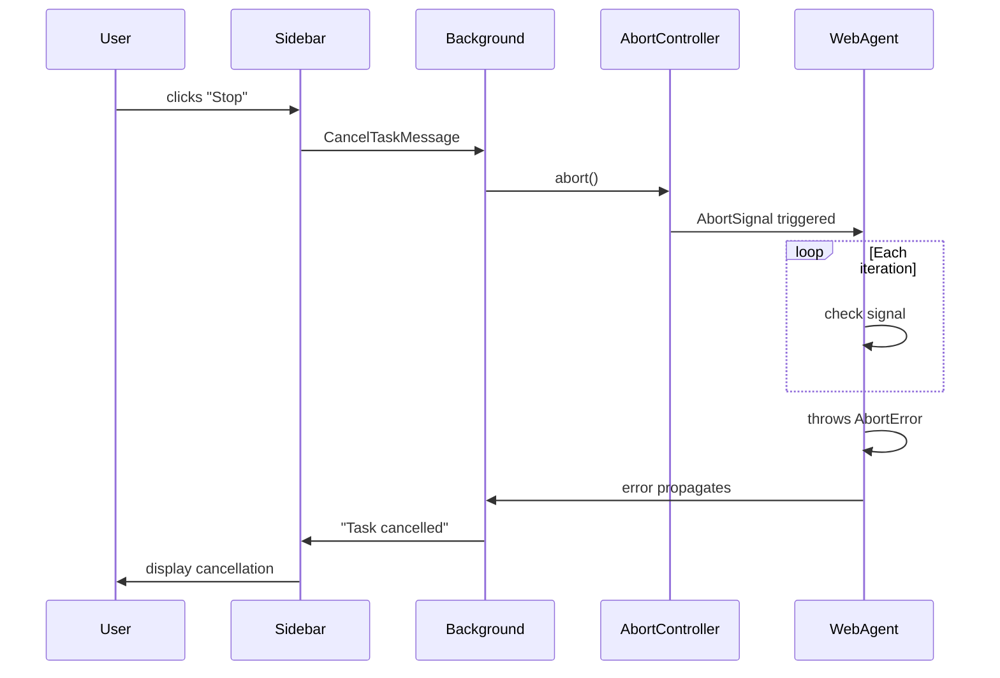

# Task Execution Flow Design Document

## Overview

This document describes the end-to-end flow of a user task execution in the Spark browser extension, from user input in the sidebar to final response display. It covers all component interactions, event broadcasting, and key decision points.

## Example Scenario

**User Input**: "What is the weather in London?"

**Expected Response**:

1. Plan phase showing the agent's strategy
2. Real-time status updates during execution
3. Final answer with weather information including temperature, conditions, humidity, etc.

**Example Output:**

## High-Level Architecture



## Detailed Component Flow

### Phase 1: User Input & Initialization

**Location**: [ChatView.tsx](../src/components/sidepanel/ChatView.tsx)

1. **User enters task** in textarea: "What is the weather in London?"
2. **User presses Enter** or clicks "Send" button
3. **`handleExecute()` async function** is triggered:
   - Validates API key is configured (checks `settings.apiKey`, opens settings if missing)
   - Adds user message to conversation store via `addMessage("user", taskText)`
   - Calls `startTask()` to generate unique task ID
   - Clears input field immediately for better UX
   - Sets execution state to `true` (disables input, shows "Stop" button)
   - Clears previous event logs via `clearEvents()`

**Key Code** (in `handleExecute()`):

```typescript
const taskText = task.trim();
addMessage("user", taskText);
const taskId = startTask();
setTask("");
setExecutionState(true);
clearEvents();
```

**Logging Opportunity**:

- Log task submission with task ID and tab ID
- Log user message addition to conversation store

### Phase 2: Message to Background Script

**Location**: [ChatView.tsx](../src/components/sidepanel/ChatView.tsx) — inside `handleExecute()`

4. **ChatView constructs `ExecuteTaskMessage`**:

   ```typescript
   const message: ExecuteTaskMessage = {
     type: "executeTask",
     task: taskText,
     apiKey: settings.apiKey,
     apiEndpoint: settings.apiEndpoint,
     model: settings.model,
     tabId: currentTab.id,
     data: { currentUrl: currentTab.url }
   };
   ```

5. **Message sent via `browser.runtime.sendMessage()`**
   - Uses `Promise.race()` with 5-minute timeout to prevent hanging
   - Prevents hanging in Firefox, where `browser.runtime.sendMessage` may never resolve if the background script is unloaded. See [Mozilla Bug 1579093](https://bugzilla.mozilla.org/show_bug.cgi?id=1579093) for details.

**Logging Opportunity**:

- Log message construction with sanitized API key (first/last 4 chars only)
- Log message send timestamp
- Log current tab URL and ID

### Phase 3: Background Script Processing

**Location**: [background.ts](../entrypoints/background.ts)

6. **Background receives message** via `browser.runtime.onMessage` listener (inside `defineBackground()`)

7. **Message validation**:
   - Type guard ensures valid message structure (checks for `type` property)
   - Ignores `realtimeEvent` messages (meant for sidebar only)

8. **Settings retrieval** from `browser.storage.local`:
   - API key, endpoint, model, provider
   - Validates API key exists, returns error if missing

9. **Task lifecycle setup** (inside `case "executeTask":`):
   - Creates `AbortController` for cancellation support
   - Validates `tabId` exists
   - Creates `EventStoreLogger` instance with `tabId` for event routing
   - **Subscribes to logger events** for indicator control (see [Indicator System](#indicator-system))
   - **Task replacement strategy**: Cancels any existing task for this tab via `runningTasks` Map
     - Note: Tasks are NOT queued - only one task runs per tab at a time
     - New tasks automatically cancel and replace existing tasks for the same tab
   - Stores controller in `runningTasks` Map
     - `runningTasks` is a `Map<number, AbortController>` tracking one task per tabId

**Key Code** (in the `executeTask` case handler):

```typescript
const abortController = new AbortController();
const tabId = executeMessage.tabId;

// Create event store logger with tabId to enable indicator forwarding
const logger = new EventStoreLogger(tabId);

// Subscribe to logger events to show/hide indicator
const unsubscribe = logger.subscribe((events) => {
  if (!indicatorShown && events.some((e) => e.type === "task:started")) {
    indicatorShown = true;
    showIndicator(tabId).catch(() => {});
  }
  if (indicatorShown && events.some((e) => e.type === "task:completed" || e.type === "task:aborted")) {
    hideIndicator(tabId).catch(() => {});
    unsubscribe();
  }
});

// Cancel any existing task for this tab
if (runningTasks.has(tabId)) {
  runningTasks.get(tabId)?.abort();
}
runningTasks.set(tabId, abortController);
```

**Logging Opportunities**:

- Log task execution start with tab ID and task preview
- Log AbortController creation
- Log cancellation of previous task (if applicable)
- Log settings retrieval success/failure

### Phase 4: Agent Manager Initialization

**Location**: [AgentManager.ts](../src/AgentManager.ts)

10. **`AgentManager.runTask()` static method** called from background.ts with:
    - Task text
    - API credentials (apiKey, apiEndpoint)
    - Model and provider settings
    - Logger instance
    - Tab ID
    - Abort signal

11. **ExtensionBrowser instantiation**:
    - Creates browser abstraction for the target tab via `new ExtensionBrowser(options.tabId)`
    - Wraps WebExtension APIs (tabs, scripting) in `AriaBrowser` interface

12. **Provider-specific model creation** (via `createProviderModel()` private method):
    - Determines provider (OpenAI or OpenRouter)
    - Gets default model if not specified (`gpt-4.1-mini` for OpenAI, `openai/gpt-4.1-mini` for OpenRouter)
    - Creates provider instance with credentials and headers

13. **WebAgent instantiation**:
    - Injects ExtensionBrowser
    - Configures provider, logger, debug settings
    - Initializes snapshot compressor and event emitter

**Key Code** (in `runTask()`):

```typescript
const browser = new ExtensionBrowser(options.tabId);

const provider = options.provider || "openai";
const modelName = options.model || this.getDefaultModel(provider);
const model = this.createProviderModel(provider, options.apiKey, options.apiEndpoint, modelName);

const agent = new WebAgent(browser, {
  providerConfig: { model, providerOptions: undefined },
  logger: options.logger,
  debug: false,
});
```

**Logging Opportunities**:

- Log ExtensionBrowser creation with tab ID
- Log provider selection and model name
- Log WebAgent initialization

### Phase 5: Task Planning (WebAgent Core)

**Location**: [src/webAgent.ts](../../src/webAgent.ts) (shared core library)

14. **`agent.execute()` method** begins:
    - Validates input parameters
    - Initializes browser and internal state
    - Creates execution state tracking object

15. **Planning phase** via `planTask()`:
    - Determines starting URL (provided URL or current page)
    - Constructs planning prompt with task and URL
    - Calls LLM with planning tools (`submit_plan`)
    - Extracts plan and success criteria from response
    - **Emits `task:started` event** with plan (handled by EventStoreLogger)

16. **Navigation phase** via `navigateToStart()`:
    - Navigates to starting URL if needed
    - Waits for page load

17. **System prompt initialization**:
    - Builds action loop system prompt with guardrails
    - Initializes task prompt with success criteria

**Event Flow**:

```typescript
// EventStoreLogger receives task:started event
{
  type: "task:started",
  data: {
    plan: "1. Navigate to weather site\n2. Search for London\n3. Extract data",
    taskId: "abc123",
    timestamp: 1234567890
  }
}
```

**Logging Opportunities**:

- Log planning phase start
- Log LLM planning request (with token count)
- Log plan extraction success/failure
- Log navigation to starting URL
- Log system prompt construction

### Phase 6: Main Execution Loop

**Location**: [src/webAgent.ts](../../src/webAgent.ts) (shared core library)

18. **Main loop begins** via `runMainLoop()`:
    - Iterates up to `maxIterations` (default: 50)
    - Each iteration:
      - Generates unique iteration ID
      - Captures page snapshot (ARIA tree) via `browser.getTreeWithRefs()`
      - Constructs context with compressed snapshot
      - Calls LLM with web action tools
      - Processes tool calls (click, fill, navigate, etc.)
      - **Emits events for each action**
      - Checks for task completion

19. **Per-iteration events** (see [Event Types Reference](#event-types-reference)):
    - `browser:action_started` - Action about to execute (e.g., "click", "fill", "goto")
    - `browser:action_completed` - Results of browser actions (success/failure)
    - `agent:status` - Status updates like "Clicking search button"
    - `agent:reasoned` - Agent's reasoning/thought process
    - `agent:action` - Action type notifications (e.g., "extract", "done")
    - `ai:generation:error` - LLM errors (recoverable and non-recoverable)
    - `task:validation_error` - Task validation failures

20. **Tool execution examples**:
    - `click_element(ref: "s1e5")` → Clicks element, waits for navigation
    - `type_text(ref: "s1e3", text: "London")` → Types into input field
    - `goto(url: "https://weather.com")` → Navigates to URL
    - `task_complete(answer: "...")` → Submits final answer

**Event Broadcasting Flow**:



**Logging Opportunities**:

- Log each iteration start with iteration number and page URL
- Log snapshot capture duration and size
- Log LLM request with token counts (input/output)
- Log tool execution with parameters
- Log browser action success/failure with timing
- Log action repetition detection
- Log error recovery attempts

### Phase 7: Real-Time Event Display

**Location**: [ChatView.tsx](../src/components/sidepanel/ChatView.tsx)

21. **Sidebar event listener** (in `useEffect` hook with `browser.runtime.onMessage`) processes real-time events:

22. **Event type handling** (inside `handleMessage` callback):
    - `task:started` → Displays plan in chat bubble via `addMessage("plan", ...)`
    - `agent:reasoned` → Streams reasoning messages via `addMessage("reasoning", ...)`
    - `agent:status` → Updates status spinner text via `addMessage("status", ...)`
    - `browser:action_started` → Shows action status via `formatBrowserAction()` helper
    - `agent:action` → Shows action-specific status (e.g., "Extracting data" for extract action)
    - `ai:generation:error` → Shows errors (filtered via `shouldDisplayError()`)
    - `task:validation_error` → Shows validation failures (filtered)
    - `browser:action:completed` → Shows action failures (filtered, only non-recoverable)

23. **Error filtering** via `shouldDisplayError()` function:
    - Hides recoverable errors during retry attempts
    - Hides validation errors below `MAX_VALIDATION_RETRIES` (3)
    - Hides tool errors that will be auto-retried (`isToolError: true`)
    - Only shows fatal/non-recoverable errors

24. **Task bubble rendering** via `TaskBubble` component:
    - Groups messages by task ID
    - Shows section headings: "📋 Plan", "💭 Actions", "✨ Answer"
    - Displays loading spinner for active tasks
    - Shows timestamp for completed tasks

**UI Structure**:

```
┌─────────────────────────────┐
│ ⚡ Spark                     │
│                              │
│ 📋 Plan:                     │
│ Overall Strategy             │
│ [Plan text from LLM]         │
│                              │
│ 💭 Actions:                  │
│ [Reasoning message 1]        │
│ [Reasoning message 2]        │
│                              │
│ ⏳ Extracting weather data   │ ← Status message with spinner
│                              │
└─────────────────────────────┘
```

**Logging Opportunities**:

- Log event reception with type and timestamp delta
- Log event filtering decisions (why error was hidden/shown)
- Log message additions to conversation store
- Log UI render cycles

### Phase 8: Task Completion & Validation

**Location**: [src/webAgent.ts](../../src/webAgent.ts) (shared core library)

25. **Task completion detection**:
    - Agent calls `task_complete` tool with final answer
    - WebAgent captures answer and exits loop
    - **Emits `task:completed` event** (triggers indicator hide)

26. **Validation phase**:
    - Checks if answer meets success criteria
    - Uses validation prompt to assess quality
    - Retries if validation fails (up to `maxValidationAttempts`)
    - **Emits `task:validation_error` if insufficient**

27. **Final result construction**:
    - Builds `TaskExecutionResult` with success flag
    - Includes execution statistics (iterations, duration, action count)
    - Returns to AgentManager

**Logging Opportunities**:

- Log task completion detection
- Log validation phase start
- Log validation result (pass/fail with reasoning)
- Log retry attempts for failed validation
- Log final result construction with stats

### Phase 9: Response Back to Sidebar

**Location**: [background.ts](../entrypoints/background.ts) — inside the `executeTask` case handler

28. **AgentManager returns result** to background script (or throws error)

29. **Background constructs `ExecuteTaskResponse`**:

    ```typescript
    // On success:
    { success: true, result: "Current weather in London..." }

    // On cancellation (treated as success for UX):
    { success: true, result: "Task cancelled" }

    // On error:
    { success: false, message: "Task execution failed: ..." }
    ```

30. **Error/cancellation handling**:
    - On cancellation: Emits `task:aborted` event with reason "Task cancelled by user"
    - On error: Emits `task:aborted` event with error message
    - Both trigger indicator hide via the logger subscription

31. **Cleanup** (in `finally` block):
    - Hides indicator via `hideIndicator(tabId)`
    - Removes task from `runningTasks` Map via `runningTasks.delete(tabId)`
    - AbortController garbage collected

32. **Response sent back** to ChatView via Promise resolution

**Logging Opportunities**:

- Log task execution completion with duration
- Log result success/failure
- Log cleanup of running tasks
- Log response size and event count

### Phase 10: Final UI Update

**Location**: [ChatView.tsx](../src/components/sidepanel/ChatView.tsx) — inside `handleExecute()` after `await` resolves

33. **ChatView receives response**:
    - Checks `response.success` flag
    - Extracts result text or error message
    - Adds final result message to conversation via `addMessage("result", resultText, taskId)`

34. **Final state updates** (in `finally` block):
    - `setExecutionState(false)` → Re-enables input, hides "Stop" button
    - `endTask()` → Clears currentTaskId
    - TaskBubble removes spinner, shows timestamp

35. **User sees complete response**:
    ```
    ⚡ Spark
    📋 Plan: [...]
    💭 Actions: [...]
    ✨ Answer:
    Current Weather in London, England
    Temperature: 51°F
    ...
    10:53:56 PM
    ```

**Logging Opportunities**:

- Log response reception with timing
- Log final message addition to UI
- Log execution state transition back to idle
- Log task end with total duration

## Task Management Architecture

### No Task Queue or Task Manager Class

The extension uses a simple **task replacement strategy** rather than a traditional queue:

- **Single Map**: `runningTasks` is a `Map<number, AbortController>` defined at the top of the `defineBackground()` function
- **One task per tab**: Each browser tab can have at most one running task
- **Automatic cancellation**: New tasks automatically abort existing tasks for the same tab
- **No queuing**: Tasks are never queued or waiting - they execute immediately or replace the current task

**Rationale**: This design prioritizes responsiveness - users expect their latest request to execute immediately rather than waiting in a queue. The abort mechanism ensures clean cancellation of superseded tasks.

**Multi-tab support**: Different tabs can run tasks concurrently since they're keyed by unique `tabId` values.

## Indicator System

**Location**: [indicatorControl.ts](../src/background/indicatorControl.ts)

The indicator system provides visual feedback during task execution by showing a purple glowing border around the page.

### How It Works

1. **Trigger**: When `task:started` event is emitted, the indicator is shown via `showIndicator(tabId)`
2. **CSS Injection**: Injects indicator CSS into the current page via `browser.scripting.insertCSS()`
3. **Class Toggle**: Adds `spark-indicator-active` class to `<html>` element
4. **Animation**: CSS creates a pulsing purple glow effect using `box-shadow` and `@keyframes`
5. **Hide**: When `task:completed` or `task:aborted` event is emitted, the indicator is hidden via `hideIndicator(tabId)`

### Navigation Persistence

The indicator persists across page navigations within a task:

- **CSS Registration**: `ensureIndicatorCSSRegistered()` registers a content script that injects CSS at `document_start`
- **Fast Re-injection**: `webNavigation.onCommitted` listener re-applies the class immediately on navigation
- **Fallback**: `tabs.onUpdated` listener re-applies on `complete` status as a reliability fallback

### Key Functions

- `showIndicator(tabId)` — Injects CSS and adds activation class
- `hideIndicator(tabId)` — Removes class and CSS, unregisters if no active indicators
- `setupNavigationListener()` — Sets up listeners for navigation persistence
- `cleanupStaleRegistrations()` — Cleans up orphaned registrations from previous sessions

### Indicator State Tracking

- `activeIndicators: Set<number>` — Tracks which tabs have active indicators
- `cssRegistered: boolean` — Tracks if the CSS content script is registered

## Event Types Reference

Events flow from WebAgent through EventStoreLogger to the sidebar. Each event has a `type`, `data`, and `timestamp`.

### Task Lifecycle Events

| Event Type | Description | Key Data Fields |
|------------|-------------|-----------------|
| `task:started` | Planning complete, execution begins | `plan`, `taskId` |
| `task:completed` | Task finished successfully | `finalAnswer`, `timestamp` |
| `task:aborted` | Task cancelled or failed | `reason`, `finalAnswer` |
| `task:validation_error` | Answer validation failed | `errors[]`, `retryCount` |

### Agent Events

| Event Type | Description | Key Data Fields |
|------------|-------------|-----------------|
| `agent:status` | Status update message | `message` |
| `agent:reasoned` | Agent's reasoning/thought | `thought` |
| `agent:action` | Action type notification | `action` (e.g., "extract", "done") |

### Browser Action Events

| Event Type | Description | Key Data Fields |
|------------|-------------|-----------------|
| `browser:action_started` | Action about to execute | `action`, `value`, `ref` |
| `browser:action_completed` | Action finished | `success`, `error`, `isRecoverable` |

### AI Events

| Event Type | Description | Key Data Fields |
|------------|-------------|-----------------|
| `ai:generation` | LLM API call completed | `usage`, `model` |
| `ai:generation:error` | LLM API call failed | `error`, `isToolError` |

### Event Filtering

The `shouldDisplayError()` function in ChatView.tsx filters which errors are shown to users:

- **Hidden**: Validation errors below `MAX_VALIDATION_RETRIES` (3)
- **Hidden**: Browser action errors marked as `isRecoverable: true`
- **Hidden**: AI generation errors marked as `isToolError: true`
- **Shown**: All other errors (fatal/non-recoverable)

## Key Interactions Across Components

### Sidebar ↔ Background Script

**Messages** (defined in [types/browser.ts](../src/types/browser.ts)):

1. `ExecuteTaskMessage` (Sidebar → Background) — Start task execution
2. `RealtimeEventMessage` (Background → Sidebar, broadcast) — Real-time event updates
3. `CancelTaskMessage` (Sidebar → Background) — Cancel running task
4. `ExecuteTaskResponse` (Background → Sidebar, Promise result) — Final result

**RealtimeEventMessage Structure**:

```typescript
{
  type: "realtimeEvent",
  tabId: number,        // Tab ID for routing
  event: {
    type: string,       // Event type (e.g., "task:started", "agent:status")
    data: unknown,      // Event-specific data
    timestamp: number
  }
}
```

**Data Flow**:

- Task parameters flow from Sidebar to Background
- Real-time events broadcast from Background to all extension contexts (includes `tabId` for routing)
- Final result flows back via Promise resolution

### Background Script ↔ Content Script

**Interactions**:

1. **Script execution**: `browser.scripting.executeScript()` for ARIA snapshots and actions
2. **Navigation**: `browser.tabs.update()` for URL changes
3. **CSS injection**: `browser.scripting.insertCSS()` / `removeCSS()` for indicator

**ExtensionBrowser Methods** ([ExtensionBrowser.ts](../src/ExtensionBrowser.ts)):

- `goto(url)` → `browser.tabs.update()` + `handlePageTransition()`
- `getTreeWithRefs()` → `browser.scripting.executeScript(generateAriaTree)` — Returns ARIA tree as string
- `getSimpleHtml()` → `browser.scripting.executeScript()` — Returns cleaned HTML
- `getMarkdown()` → Converts HTML to markdown via Turndown
- `performAction(ref, action, value)` → Executes actions (click, fill, select, etc.) in page context
- `waitForLoadState(state)` → Waits for DOM/load/networkidle states
- `goBack()` / `goForward()` → Browser history navigation

### AgentManager ↔ WebAgent

**Initialization** (in `AgentManager.runTask()`):

```typescript
const agent = new WebAgent(extensionBrowser, {
  providerConfig: { model, providerOptions: undefined },
  logger: eventStoreLogger,
  debug: false,
});
```

**Execution**:

```typescript
const result = await agent.execute(task, {
  data: { currentUrl },
  abortSignal: controller.signal,
});
return result.finalAnswer || "Task completed successfully";
```

**Event Flow**:



### EventStoreLogger ↔ Sidebar

**Real-time Broadcasting** (in `EventStoreLogger.handleEvent()`):

1. WebAgent emits event via logger callback
2. `EventStoreLogger.handleEvent()` stores event in array
3. Notifies subscribers (for indicator control in background.ts)
4. `browser.runtime.sendMessage()` broadcasts to all contexts
5. Sidebar's `onMessage` listener receives
6. Event added to conversation store
7. React re-renders with new event

**Event Structure**:

```typescript
{
  type: "realtimeEvent",
  tabId: 123,  // Required for routing to correct sidebar instance
  event: {
    type: "agent:status",
    data: { message: "Clicking search button" },
    timestamp: 1234567890
  }
}
```

## Critical Logging Recommendations

### High Priority: Missing Observability

These areas would significantly benefit from additional logging:

#### 1. **ExtensionBrowser Actions** ([ExtensionBrowser.ts](../src/ExtensionBrowser.ts))

The ExtensionBrowser now includes logging via `createLogger("ExtensionBrowser")`. Key logged operations:

- `goto()` — Logs URL, current URL, tab ID, and completion status
- `getTreeWithRefs()` — Logs content script availability and ARIA tree generation
- `getSimpleHtml()` / `getMarkdown()` — Logs content retrieval status

Additional logging could be added for:

```typescript
// In performAction()
this.logger.info("Performing action", { ref, action, value, tabId: this.tabId });
```

**Why**: Critical for debugging action failures, navigation timing issues, and understanding agent behavior.

#### 2. **Event Broadcasting** ([EventStoreLogger.ts](../src/EventStoreLogger.ts))

Currently swallows errors silently in `handleEvent()`:

```typescript
browser.runtime.sendMessage(message).catch(() => {
  // Ignore errors if no listeners or sidepanel isn't open
});
```

Consider logging for debugging:

```typescript
browser.runtime.sendMessage(message).catch((error) => {
  this.logger.warn("Failed to broadcast event", {
    eventType: event.type,
    error: error.message,
  });
});
```

**Why**: Helps identify when sidebar isn't receiving events, critical for debugging "stuck task" issues.

#### 3. **Snapshot Compression** (Currently in core WebAgent)

Snapshot compression heavily impacts token usage and context quality:

```typescript
private async compressSnapshot(): Promise<string> {
  const start = Date.now();
  const snapshot = await this.browser.snapshot();
  const compressed = this.compressor.compress(snapshot);
  const duration = Date.now() - start;

  this.logger.debug("Snapshot compressed", {
    originalSize: snapshot.length,
    compressedSize: compressed.length,
    compressionRatio: (compressed.length / snapshot.length).toFixed(2),
    durationMs: duration
  });

  return compressed;
}
```

**Why**: Token usage directly impacts cost and context quality. Understanding compression efficiency helps optimize performance.

#### 4. **LLM Request/Response Timing**

Currently minimal logging in WebAgent loop:

```typescript
this.logger.info("LLM request", {
  iteration: state.currentIteration,
  inputTokens: response.usage.promptTokens,
  outputTokens: response.usage.completionTokens,
  durationMs: requestDuration,
  toolCalls: response.toolResults.length,
});
```

**Why**: LLM latency is often the bottleneck. Tracking timing helps identify slow requests and optimize prompts.

#### 5. **Error Recovery Tracking**

Currently errors logged but recovery attempts not tracked:

```typescript
catch (error) {
  this.logger.error("Action failed", { action, error });
  consecutiveErrors++;

  // Add recovery tracking
  this.logger.info("Error recovery attempt", {
    attemptNumber: consecutiveErrors,
    maxAttempts: this.maxConsecutiveErrors,
    lastAction: state.lastAction,
    willRetry: consecutiveErrors < this.maxConsecutiveErrors
  });
}
```

**Why**: Understanding recovery patterns helps tune error thresholds and improve reliability.

### Medium Priority: Enhanced Debugging

#### 6. **Message Passing Timing**

Add timing for extension message passing:

```typescript
// ChatView.tsx
const sendTimestamp = Date.now();
const response = await browser.runtime.sendMessage(message);
const receiveTimestamp = Date.now();

logger.debug("Message round-trip complete", {
  messageType: message.type,
  roundTripMs: receiveTimestamp - sendTimestamp,
});
```

**Why**: Helps identify when background script is slow to respond or hanging.

#### 7. **Conversation Store Operations**

Track conversation store updates:

```typescript
// conversationStore.ts
addMessage: (tabId, type, content, taskId) => {
  logger.debug("Adding message to conversation", {
    tabId,
    type,
    taskId,
    contentLength: content.length,
    totalMessages: get().conversations[tabId]?.messages.length || 0,
  });
  // ... existing code
};
```

**Why**: Helps debug message ordering issues and state persistence problems.

### Low Priority: Nice-to-Have

#### 8. **Auto-scroll Behavior** ([useAutoScroll.ts](../src/hooks/useAutoScroll.ts))

```typescript
const handleScroll = () => {
  const isAtBottom = /* calculation */;
  logger.debug("Scroll position changed", {
    isAtBottom,
    scrollTop,
    scrollHeight,
    tabId
  });
};
```

**Why**: Helps debug UX issues with message list scrolling.

#### 9. **Settings Persistence**

```typescript
// settingsStore.ts
setApiKey: (apiKey) => {
  logger.info("API key updated", {
    hasKey: !!apiKey,
    keyLength: apiKey?.length,
  });
  // ... existing code
};
```

**Why**: Helps debug configuration issues.

## Performance Characteristics

### Bottlenecks

1. **LLM Requests**: 2-5 seconds per iteration (network + inference)
2. **Snapshot Generation**: 100-500ms depending on page complexity
3. **Page Navigation**: 1-3 seconds for page loads
4. **Compression**: 10-50ms depending on snapshot size

### Typical Task Timeline

For "What is the weather in London?":

```
0ms      ─── User clicks Send
10ms     ─── Message sent to background
20ms     ─── AgentManager initialized
50ms     ─── Planning phase starts
2000ms   ─── Plan received (LLM)
2100ms   ─── Navigation to weather.com
5000ms   ─── Page loaded (network)
5200ms   ─── Snapshot captured
5300ms   ─── Iteration 1 LLM request
7500ms   ─── Click search button
10000ms  ─── Page updated
10200ms  ─── Snapshot captured
10300ms  ─── Iteration 2 LLM request
13000ms  ─── Extract data
13100ms  ─── Iteration 3 LLM request
15000ms  ─── Task complete
15100ms  ─── Validation passed
15200ms  ─── Response sent to sidebar
15210ms  ─── UI updated with result
```

**Total**: ~15 seconds for simple task

### Optimization Opportunities

1. **Parallel snapshot + compression**: Run while LLM request in flight
2. **Cached snapshots**: For repeated actions on same page
3. **Streaming responses**: Display partial results earlier
4. **Prompt optimization**: Reduce token usage, faster inference

## Error Handling & Recovery

### Error Types

1. **Recoverable Errors** (auto-retry):
   - Tool execution errors (e.g., element not found)
   - Validation failures below max retries
   - Network timeouts with retry budget

2. **Non-Recoverable Errors** (user-facing):
   - API key invalid/missing
   - Max retries exceeded
   - Abort signal triggered
   - Fatal browser errors

### Error Flow



### Cancellation Flow



## Security Considerations

### Credential Handling

- API keys stored in browser.storage.local (encrypted by browser)
- Never passed to content scripts (background only)
- Not logged (sanitized in logs as "key\_\*\*\*\*")

### Content Security

- Content scripts isolated from page scripts
- No eval() or unsafe script injection
- ARIA snapshots safe (read-only DOM inspection)

### XSS Prevention

- Markdown rendering via marked-react (sanitized)
- No dangerouslySetInnerHTML
- User input escaped before display

## Testing Considerations

### Key Test Scenarios

1. **Happy path**: Simple task completes successfully
2. **Cancellation**: User stops mid-execution
3. **Errors**: Recovery from various failure modes
4. **Multi-tab**: Multiple concurrent tasks
5. **Real-time events**: Event broadcasting and filtering
6. **Validation**: Task quality checking

### Mock Points

- WebExtension APIs (via webextension-polyfill mocks)
- LLM responses (via provider mocks)
- Browser snapshots (via ExtensionBrowser mocks)
- Event broadcasting (via EventStoreLogger mocks)

## Future Enhancements

### Potential Improvements

1. **Streaming UI updates**: Display LLM reasoning as it's generated
2. **Persistent sessions**: Resume tasks after extension reload
3. **Multi-tab coordination**: Tasks spanning multiple tabs
4. **Performance metrics**: Built-in timing dashboard
5. **Replay mode**: Re-run previous tasks with same steps
6. **Custom action library**: User-defined automation macros

### Scalability Considerations

- **Service worker lifetime**: May need external state persistence
- **Large pages**: Implement snapshot chunking
- **Long tasks**: Implement checkpoint/resume
- **Event volume**: Implement event buffering/throttling

## Conclusion

The Spark extension architecture provides a solid foundation for AI-powered web automation with clear component boundaries and event-driven communication. The key areas for improving observability are:

1. **ExtensionBrowser action logging** - Critical for debugging
2. **Event broadcasting error handling** - Prevents silent failures
3. **Snapshot compression metrics** - Optimizes token usage
4. **LLM request/response timing** - Identifies bottlenecks
5. **Error recovery tracking** - Improves reliability

These logging enhancements would provide much better visibility into task execution flow and help diagnose issues more quickly.
