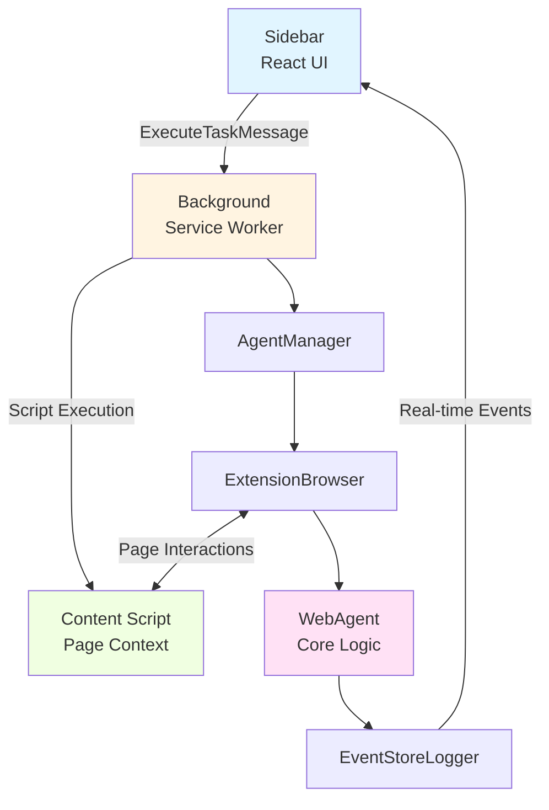
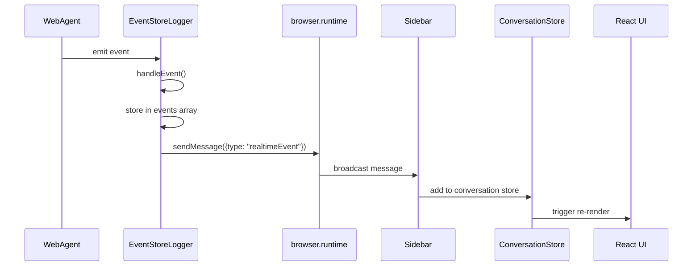
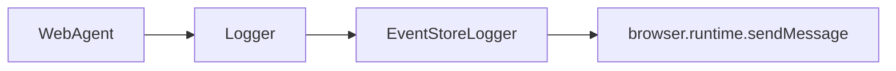
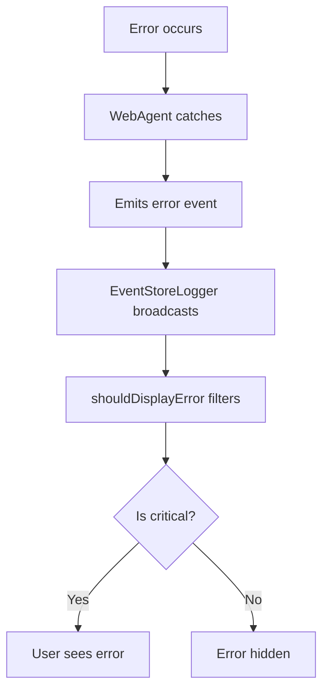
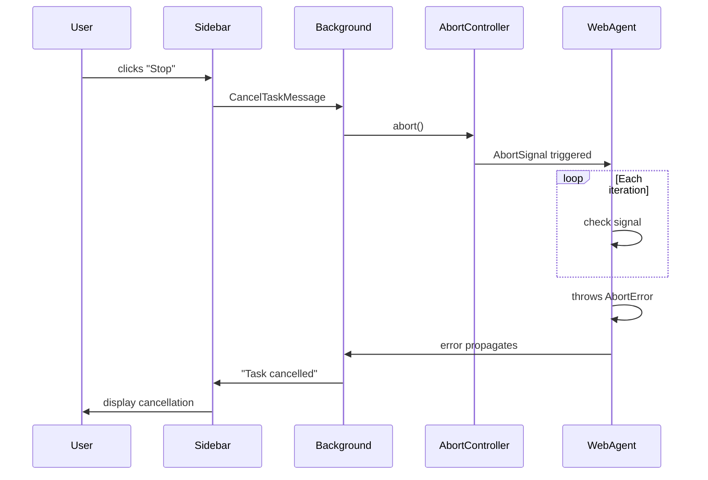

# Task Execution Flow Design Document

## Overview

This document describes the end-to-end flow of a user task execution in the Spark browser extension, from user input in the sidebar to final response display. It covers all component interactions, event broadcasting, and key decision points.

## Example Scenario

**User Input**: "What is the weather in London?"

**Expected Response**:

1. Plan phase showing the agent's strategy
2. Real-time status updates during execution
3. Final answer with weather information including temperature, conditions, humidity, etc.

**Example Output:**

## High-Level Architecture



## Detailed Component Flow

### Phase 1: User Input & Initialization

**Location**: [extension/src/components/sidepanel/ChatView.tsx](../src/components/sidepanel/ChatView.tsx)

1. **User enters task** in textarea: "What is the weather in London?"
2. **User presses Enter** or clicks "Send" button
3. **ChatView.handleExecute()** is triggered:
   - Validates API key is configured ([ChatView.tsx:355-361](../src/components/sidepanel/ChatView.tsx#L355-L361))
   - Adds user message to conversation store
   - Calls `startTask()` to generate unique task ID
   - Clears input field immediately for better UX
   - Sets execution state to `true` (disables input, shows "Stop" button)
   - Clears previous event logs

**Key Code**:

```typescript
// ChatView.tsx:355-374
const taskText = task.trim();
addMessage("user", taskText);
const taskId = startTask();
setTask("");
setExecutionState(true);
clearEvents();
```

**Logging Opportunity**:

- Log task submission with task ID and tab ID
- Log user message addition to conversation store

### Phase 2: Message to Background Script

**Location**: [ChatView.tsx:384-394](../src/components/sidepanel/ChatView.tsx#L384-L394)

4. **ChatView constructs ExecuteTaskMessage**:

   ```typescript
   {
     type: "executeTask",
     task: "What is the weather in London?",
     apiKey: settings.apiKey,
     apiEndpoint: settings.apiEndpoint,
     model: settings.model,
     tabId: currentTab.id,
     data: { currentUrl: currentTab.url }
   }
   ```

5. **Message sent via browser.runtime.sendMessage()**
   - Uses Promise.race() with 5-minute timeout ([ChatView.tsx:401-404](../src/components/sidepanel/ChatView.tsx#L401-L404))
   - Prevents hanging in Firefox, where `browser.runtime.sendMessage` may never resolve if the background script is unloaded. See [Mozilla Bug 1579093](https://bugzilla.mozilla.org/show_bug.cgi?id=1579093) for details.

**Logging Opportunity**:

- Log message construction with sanitized API key (first/last 4 chars only)
- Log message send timestamp
- Log current tab URL and ID

### Phase 3: Background Script Processing

**Location**: [extension/entrypoints/background.ts](../entrypoints/background.ts)

6. **Background receives message** via `browser.runtime.onMessage` listener ([background.ts:60-224](../entrypoints/background.ts#L60-L224))

7. **Message validation**:
   - Type guard ensures valid message structure ([background.ts:62-64](../entrypoints/background.ts#L62-L64))
   - Ignores `realtimeEvent` messages (meant for sidebar only)

8. **Settings retrieval** from browser.storage.local:
   - API key, endpoint, model, provider ([background.ts:88-94](../entrypoints/background.ts#L88-L94))
   - Validates API key exists

9. **Task lifecycle setup**:
   - Creates `EventStoreLogger` instance ([background.ts:105](../entrypoints/background.ts#L105))
   - Creates `AbortController` for cancellation support ([background.ts:108](../entrypoints/background.ts#L108))
   - **Task replacement strategy**: Cancels any existing task for this tab ([background.ts:120-122](../entrypoints/background.ts#L120-L122))
     - Note: Tasks are NOT queued - only one task runs per tab at a time
     - New tasks automatically cancel and replace existing tasks for the same tab
   - Stores controller in `runningTasks` Map ([background.ts:124](../entrypoints/background.ts#L124))
     - `runningTasks` is a `Map<number, AbortController>` tracking one task per tabId ([background.ts:24](../entrypoints/background.ts#L24))

**Key Code**:

```typescript
// background.ts:105-124
const logger = new EventStoreLogger();
const abortController = new AbortController();
const tabId = executeMessage.tabId;

// Cancel any existing task for this tab
if (runningTasks.has(tabId)) {
  runningTasks.get(tabId)?.abort();
}
runningTasks.set(tabId, abortController);
```

**Logging Opportunities**:

- Log task execution start with tab ID and task preview
- Log AbortController creation
- Log cancellation of previous task (if applicable)
- Log settings retrieval success/failure

### Phase 4: Agent Manager Initialization

**Location**: [extension/src/AgentManager.ts](../src/AgentManager.ts)

10. **AgentManager.runTask()** called with:
    - Task text
    - API credentials
    - Logger instance
    - Tab ID
    - Abort signal ([background.ts:133-142](../entrypoints/background.ts#L133-L142))

11. **ExtensionBrowser instantiation**:
    - Creates browser abstraction for the target tab ([AgentManager.ts:50](../src/AgentManager.ts#L50))
    - Wraps WebExtension APIs (tabs, scripting) in `AriaBrowser` interface

12. **Provider-specific model creation** ([AgentManager.ts:54-60](../src/AgentManager.ts#L54-60)):
    - Determines provider (OpenAI or OpenRouter)
    - Gets default model if not specified
    - Creates provider instance with credentials and headers

13. **WebAgent instantiation** ([AgentManager.ts:63-70](../src/AgentManager.ts#L63-L70)):
    - Injects ExtensionBrowser
    - Configures provider, logger, debug settings
    - Initializes snapshot compressor and event emitter

**Key Code**:

```typescript
// AgentManager.ts:50-70
const browser = new ExtensionBrowser(options.tabId);
const provider = options.provider || "openai";
const modelName = options.model || this.getDefaultModel(provider);
const model = this.createProviderModel(provider, options.apiKey, options.apiEndpoint, modelName);

const agent = new WebAgent(browser, {
  providerConfig: { model, providerOptions: undefined },
  logger: options.logger,
  debug: false,
});
```

**Logging Opportunities**:

- Log ExtensionBrowser creation with tab ID
- Log provider selection and model name
- Log WebAgent initialization

### Phase 5: Task Planning (WebAgent Core)

**Location**: [src/webAgent.ts](../../src/webAgent.ts)

14. **agent.execute()** begins ([webAgent.ts:173-194](../../src/webAgent.ts#L173-L194)):
    - Validates input parameters ([webAgent.ts:175](../../src/webAgent.ts#L175))
    - Initializes browser and internal state ([webAgent.ts:178](../../src/webAgent.ts#L178))
    - Creates execution state tracking object ([webAgent.ts:180](../../src/webAgent.ts#L180))

15. **Planning phase** - `planTask()` ([webAgent.ts:184](../../src/webAgent.ts#L184)):
    - Determines starting URL (provided URL or current page)
    - Constructs planning prompt with task and URL
    - Calls LLM with planning tools (submit_plan)
    - Extracts plan and success criteria from response
    - **Emits `task:started` event** with plan ([EventStoreLogger:58-60](../src/EventStoreLogger.ts#L58-L60))

16. **Navigation phase** - `navigateToStart()` ([webAgent.ts:187](../../src/webAgent.ts#L187)):
    - Navigates to starting URL if needed
    - Waits for page load

17. **System prompt initialization** ([webAgent.ts:188](../../src/webAgent.ts#L188)):
    - Builds action loop system prompt with guardrails
    - Initializes task prompt with success criteria

**Event Flow**:

```typescript
// EventStoreLogger receives task:started event
{
  type: "task:started",
  data: {
    plan: "1. Navigate to weather site\n2. Search for London\n3. Extract data",
    taskId: "abc123",
    timestamp: 1234567890
  }
}
```

**Logging Opportunities**:

- Log planning phase start
- Log LLM planning request (with token count)
- Log plan extraction success/failure
- Log navigation to starting URL
- Log system prompt construction

### Phase 6: Main Execution Loop

**Location**: [src/webAgent.ts](../../src/webAgent.ts)

18. **Main loop begins** - `runMainLoop()`:
    - Iterates up to `maxIterations` (default: 50)
    - Each iteration:
      - Generates unique iteration ID
      - Captures page snapshot (ARIA tree)
      - Constructs context with compressed snapshot
      - Calls LLM with web action tools
      - Processes tool calls (click, type, navigate, etc.)
      - **Emits events for each action**
      - Checks for task completion

19. **Per-iteration events**:
    - `agent:status` - Status updates like "Clicking search button"
    - `agent:reasoned` - Agent's reasoning/thought process
    - `browser:action:completed` - Results of browser actions
    - `ai:generation:error` - LLM errors (recoverable and non-recoverable)
    - `task:validation_error` - Task validation failures

20. **Tool execution examples**:
    - `click_element(ref: "a")` → Clicks element, waits for navigation
    - `type_text(ref: "b", text: "London")` → Types into input field
    - `goto(url: "https://weather.com")` → Navigates to URL
    - `task_complete(answer: "...")` → Submits final answer

**Event Broadcasting Flow**:



**Logging Opportunities**:

- Log each iteration start with iteration number and page URL
- Log snapshot capture duration and size
- Log LLM request with token counts (input/output)
- Log tool execution with parameters
- Log browser action success/failure with timing
- Log action repetition detection
- Log error recovery attempts

### Phase 7: Real-Time Event Display

**Location**: [ChatView.tsx:274-353](../src/components/sidepanel/ChatView.tsx#L274-L353)

21. **Sidebar event listener** processes real-time events:

22. **Event type handling**:
    - `task:started` → Displays plan in chat bubble ([ChatView.tsx:282-289](../src/components/sidepanel/ChatView.tsx#L282-L289))
    - `agent:reasoned` → Streams reasoning messages ([ChatView.tsx:292-299](../src/components/sidepanel/ChatView.tsx#L292-L299))
    - `agent:status` → Updates status spinner text ([ChatView.tsx:302-309](../src/components/sidepanel/ChatView.tsx#L302-L309))
    - `ai:generation:error` → Shows errors (filtered) ([ChatView.tsx:312-320](../src/components/sidepanel/ChatView.tsx#L312-L320))
    - `task:validation_error` → Shows validation failures (filtered) ([ChatView.tsx:323-332](../src/components/sidepanel/ChatView.tsx#L323-L332))
    - `browser:action:completed` → Shows action failures (filtered) ([ChatView.tsx:335-344](../src/components/sidepanel/ChatView.tsx#L335-L344))

23. **Error filtering** via `shouldDisplayError()` ([ChatView.tsx:59-79](../src/components/sidepanel/ChatView.tsx#L59-L79)):
    - Hides recoverable errors during retry attempts
    - Hides validation errors below MAX_VALIDATION_RETRIES (3)
    - Hides tool errors that will be auto-retried
    - Only shows fatal/non-recoverable errors

24. **Task bubble rendering** ([ChatView.tsx:158-235](../src/components/sidepanel/ChatView.tsx#L158-L235)):
    - Groups messages by task ID
    - Shows section headings: "📋 Plan", "💭 Actions", "✨ Answer"
    - Displays loading spinner for active tasks
    - Shows timestamp for completed tasks

**UI Structure**:

```
┌─────────────────────────────┐
│ ⚡ Spark                     │
│                              │
│ 📋 Plan:                     │
│ Overall Strategy             │
│ [Plan text from LLM]         │
│                              │
│ 💭 Actions:                  │
│ [Reasoning message 1]        │
│ [Reasoning message 2]        │
│                              │
│ ⏳ Extracting weather data   │ ← Status message with spinner
│                              │
└─────────────────────────────┘
```

**Logging Opportunities**:

- Log event reception with type and timestamp delta
- Log event filtering decisions (why error was hidden/shown)
- Log message additions to conversation store
- Log UI render cycles

### Phase 8: Task Completion & Validation

**Location**: [src/webAgent.ts](../../src/webAgent.ts)

25. **Task completion detection**:
    - Agent calls `task_complete` tool with final answer
    - WebAgent captures answer and exits loop

26. **Validation phase**:
    - Checks if answer meets success criteria
    - Uses validation prompt to assess quality
    - Retries if validation fails (up to maxValidationAttempts)
    - **Emits `task:validation_error` if insufficient**

27. **Final result construction**:
    - Builds TaskExecutionResult with success flag
    - Includes execution statistics (iterations, duration, action count)
    - Returns to AgentManager

**Logging Opportunities**:

- Log task completion detection
- Log validation phase start
- Log validation result (pass/fail with reasoning)
- Log retry attempts for failed validation
- Log final result construction with stats

### Phase 9: Response Back to Sidebar

**Location**: [background.ts:144-174](../entrypoints/background.ts#L144-L174)

28. **AgentManager returns result** to background script
29. **Background constructs ExecuteTaskResponse**:

    ```typescript
    {
      success: true,
      result: "Current weather in London...",
      events: [...] // Optional fallback events
    }
    ```

30. **Cleanup**:
    - Removes task from runningTasks Map ([background.ts:173](../entrypoints/background.ts#L173))
    - AbortController garbage collected

31. **Response sent back** to ChatView via Promise resolution

**Logging Opportunities**:

- Log task execution completion with duration
- Log result success/failure
- Log cleanup of running tasks
- Log response size and event count

### Phase 10: Final UI Update

**Location**: [ChatView.tsx:415-438](../src/components/sidepanel/ChatView.tsx#L415-L438)

32. **ChatView receives response**:
    - Checks success flag
    - Extracts result text or error message
    - Adds final result message to conversation ([ChatView.tsx:417](../src/components/sidepanel/ChatView.tsx#L417))

33. **Final state updates**:
    - `setExecutionState(false)` → Re-enables input, hides "Stop" button
    - `endTask()` → Clears currentTaskId
    - TaskBubble removes spinner, shows timestamp

34. **User sees complete response**:
    ```
    ⚡ Spark
    📋 Plan: [...]
    💭 Actions: [...]
    ✨ Answer:
    Current Weather in London, England
    Temperature: 51°F
    ...
    10:53:56 PM
    ```

**Logging Opportunities**:

- Log response reception with timing
- Log final message addition to UI
- Log execution state transition back to idle
- Log task end with total duration

## Task Management Architecture

### No Task Queue or Task Manager Class

The extension uses a simple **task replacement strategy** rather than a traditional queue:

- **Single Map**: `runningTasks` is a `Map<number, AbortController>` ([background.ts:24](../entrypoints/background.ts#L24))
- **One task per tab**: Each browser tab can have at most one running task
- **Automatic cancellation**: New tasks automatically abort existing tasks for the same tab
- **No queuing**: Tasks are never queued or waiting - they execute immediately or replace the current task

**Rationale**: This design prioritizes responsiveness - users expect their latest request to execute immediately rather than waiting in a queue. The abort mechanism ensures clean cancellation of superseded tasks.

**Multi-tab support**: Different tabs can run tasks concurrently since they're keyed by unique `tabId` values.

## Key Interactions Across Components

### Sidebar ↔ Background Script

**Messages**:

1. `ExecuteTaskMessage` (Sidebar → Background)
2. `RealtimeEventMessage` (Background → Sidebar, broadcast)
3. `CancelTaskMessage` (Sidebar → Background)
4. `ExecuteTaskResponse` (Background → Sidebar, Promise result)

**Data Flow**:

- Task parameters flow from Sidebar to Background
- Real-time events broadcast from Background to all extension contexts
- Final result flows back via Promise resolution

### Background Script ↔ Content Script

**Interactions**:

1. **Page info retrieval**: `browser.tabs.sendMessage({ type: "getPageInfo" })`
2. **Script execution**: `browser.scripting.executeScript()` for ARIA snapshots
3. **Navigation**: `browser.tabs.update()` for URL changes

**ExtensionBrowser Methods** ([extension/src/ExtensionBrowser.ts](../src/ExtensionBrowser.ts)):

- `goto(url)` → browser.tabs.update()
- `snapshot()` → browser.scripting.executeScript(generateAriaTree)
- `evaluate(script)` → browser.scripting.executeScript()
- `click(selector)` → Executes script in page context

### AgentManager ↔ WebAgent

**Initialization**:

```typescript
const agent = new WebAgent(extensionBrowser, {
  providerConfig: { model },
  logger: eventStoreLogger,
  debug: false,
});
```

**Execution**:

```typescript
const result = await agent.execute(task, {
  data: { currentUrl },
  abortSignal: controller.signal,
});
```

**Event Flow**:



### EventStoreLogger ↔ Sidebar

**Real-time Broadcasting**:

1. WebAgent emits event via logger.log()
2. EventStoreLogger.handleEvent() stores and broadcasts
3. browser.runtime.sendMessage() sends to all contexts
4. Sidebar's onMessage listener receives
5. Event added to conversation store
6. React re-renders with new event

**Event Structure**:

```typescript
{
  type: "realtimeEvent",
  event: {
    type: "agent:status",
    data: { message: "Clicking search button" },
    timestamp: 1234567890
  }
}
```

## Critical Logging Recommendations

### High Priority: Missing Observability

These areas would significantly benefit from additional logging:

#### 1. **ExtensionBrowser Actions** ([extension/src/ExtensionBrowser.ts](../src/ExtensionBrowser.ts))

Currently no logging in browser abstraction layer. Recommend:

```typescript
async goto(url: string): Promise<void> {
  this.logger.info("Navigating to URL", { url, tabId: this.tabId });
  await browser.tabs.update(this.tabId, { url });
  this.logger.info("Navigation initiated", { url, tabId: this.tabId });
  await this.waitForLoadState("networkidle");
  this.logger.info("Navigation complete", { url, tabId: this.tabId });
}
```

**Why**: Critical for debugging navigation timing issues, failed page loads, and understanding agent behavior.

#### 2. **Event Broadcasting** ([extension/src/EventStoreLogger.ts:71-88](../src/EventStoreLogger.ts#L71-L88))

Currently swallows errors silently:

```typescript
browser.runtime.sendMessage(message).catch(() => {
  // Ignore errors if no listeners or sidepanel isn't open
});
```

Recommend:

```typescript
browser.runtime.sendMessage(message).catch((error) => {
  this.logger.warn("Failed to broadcast event", {
    eventType: event.type,
    error: error.message,
    hasListeners: browser.runtime.hasListeners,
  });
});
```

**Why**: Helps identify when sidebar isn't receiving events, critical for debugging "stuck task" issues.

#### 3. **Snapshot Compression** (Currently in core WebAgent)

Snapshot compression heavily impacts token usage and context quality:

```typescript
private async compressSnapshot(): Promise<string> {
  const start = Date.now();
  const snapshot = await this.browser.snapshot();
  const compressed = this.compressor.compress(snapshot);
  const duration = Date.now() - start;

  this.logger.debug("Snapshot compressed", {
    originalSize: snapshot.length,
    compressedSize: compressed.length,
    compressionRatio: (compressed.length / snapshot.length).toFixed(2),
    durationMs: duration
  });

  return compressed;
}
```

**Why**: Token usage directly impacts cost and context quality. Understanding compression efficiency helps optimize performance.

#### 4. **LLM Request/Response Timing**

Currently minimal logging in WebAgent loop:

```typescript
this.logger.info("LLM request", {
  iteration: state.currentIteration,
  inputTokens: response.usage.promptTokens,
  outputTokens: response.usage.completionTokens,
  durationMs: requestDuration,
  toolCalls: response.toolResults.length,
});
```

**Why**: LLM latency is often the bottleneck. Tracking timing helps identify slow requests and optimize prompts.

#### 5. **Error Recovery Tracking**

Currently errors logged but recovery attempts not tracked:

```typescript
catch (error) {
  this.logger.error("Action failed", { action, error });
  consecutiveErrors++;

  // Add recovery tracking
  this.logger.info("Error recovery attempt", {
    attemptNumber: consecutiveErrors,
    maxAttempts: this.maxConsecutiveErrors,
    lastAction: state.lastAction,
    willRetry: consecutiveErrors < this.maxConsecutiveErrors
  });
}
```

**Why**: Understanding recovery patterns helps tune error thresholds and improve reliability.

### Medium Priority: Enhanced Debugging

#### 6. **Message Passing Timing**

Add timing for extension message passing:

```typescript
// ChatView.tsx
const sendTimestamp = Date.now();
const response = await browser.runtime.sendMessage(message);
const receiveTimestamp = Date.now();

logger.debug("Message round-trip complete", {
  messageType: message.type,
  roundTripMs: receiveTimestamp - sendTimestamp,
});
```

**Why**: Helps identify when background script is slow to respond or hanging.

#### 7. **Conversation Store Operations**

Track conversation store updates:

```typescript
// conversationStore.ts
addMessage: (tabId, type, content, taskId) => {
  logger.debug("Adding message to conversation", {
    tabId,
    type,
    taskId,
    contentLength: content.length,
    totalMessages: get().conversations[tabId]?.messages.length || 0,
  });
  // ... existing code
};
```

**Why**: Helps debug message ordering issues and state persistence problems.

### Low Priority: Nice-to-Have

#### 8. **Auto-scroll Behavior** ([extension/src/hooks/useAutoScroll.ts](../src/hooks/useAutoScroll.ts))

```typescript
const handleScroll = () => {
  const isAtBottom = /* calculation */;
  logger.debug("Scroll position changed", {
    isAtBottom,
    scrollTop,
    scrollHeight,
    tabId
  });
};
```

**Why**: Helps debug UX issues with message list scrolling.

#### 9. **Settings Persistence**

```typescript
// settingsStore.ts
setApiKey: (apiKey) => {
  logger.info("API key updated", {
    hasKey: !!apiKey,
    keyLength: apiKey?.length,
  });
  // ... existing code
};
```

**Why**: Helps debug configuration issues.

## Performance Characteristics

### Bottlenecks

1. **LLM Requests**: 2-5 seconds per iteration (network + inference)
2. **Snapshot Generation**: 100-500ms depending on page complexity
3. **Page Navigation**: 1-3 seconds for page loads
4. **Compression**: 10-50ms depending on snapshot size

### Typical Task Timeline

For "What is the weather in London?":

```
0ms      ─── User clicks Send
10ms     ─── Message sent to background
20ms     ─── AgentManager initialized
50ms     ─── Planning phase starts
2000ms   ─── Plan received (LLM)
2100ms   ─── Navigation to weather.com
5000ms   ─── Page loaded (network)
5200ms   ─── Snapshot captured
5300ms   ─── Iteration 1 LLM request
7500ms   ─── Click search button
10000ms  ─── Page updated
10200ms  ─── Snapshot captured
10300ms  ─── Iteration 2 LLM request
13000ms  ─── Extract data
13100ms  ─── Iteration 3 LLM request
15000ms  ─── Task complete
15100ms  ─── Validation passed
15200ms  ─── Response sent to sidebar
15210ms  ─── UI updated with result
```

**Total**: ~15 seconds for simple task

### Optimization Opportunities

1. **Parallel snapshot + compression**: Run while LLM request in flight
2. **Cached snapshots**: For repeated actions on same page
3. **Streaming responses**: Display partial results earlier
4. **Prompt optimization**: Reduce token usage, faster inference

## Error Handling & Recovery

### Error Types

1. **Recoverable Errors** (auto-retry):
   - Tool execution errors (e.g., element not found)
   - Validation failures below max retries
   - Network timeouts with retry budget

2. **Non-Recoverable Errors** (user-facing):
   - API key invalid/missing
   - Max retries exceeded
   - Abort signal triggered
   - Fatal browser errors

### Error Flow



### Cancellation Flow



## Security Considerations

### Credential Handling

- API keys stored in browser.storage.local (encrypted by browser)
- Never passed to content scripts (background only)
- Not logged (sanitized in logs as "key\_\*\*\*\*")

### Content Security

- Content scripts isolated from page scripts
- No eval() or unsafe script injection
- ARIA snapshots safe (read-only DOM inspection)

### XSS Prevention

- Markdown rendering via marked-react (sanitized)
- No dangerouslySetInnerHTML
- User input escaped before display

## Testing Considerations

### Key Test Scenarios

1. **Happy path**: Simple task completes successfully
2. **Cancellation**: User stops mid-execution
3. **Errors**: Recovery from various failure modes
4. **Multi-tab**: Multiple concurrent tasks
5. **Real-time events**: Event broadcasting and filtering
6. **Validation**: Task quality checking

### Mock Points

- WebExtension APIs (via webextension-polyfill mocks)
- LLM responses (via provider mocks)
- Browser snapshots (via ExtensionBrowser mocks)
- Event broadcasting (via EventStoreLogger mocks)

## Future Enhancements

### Potential Improvements

1. **Streaming UI updates**: Display LLM reasoning as it's generated
2. **Persistent sessions**: Resume tasks after extension reload
3. **Multi-tab coordination**: Tasks spanning multiple tabs
4. **Performance metrics**: Built-in timing dashboard
5. **Replay mode**: Re-run previous tasks with same steps
6. **Custom action library**: User-defined automation macros

### Scalability Considerations

- **Service worker lifetime**: May need external state persistence
- **Large pages**: Implement snapshot chunking
- **Long tasks**: Implement checkpoint/resume
- **Event volume**: Implement event buffering/throttling

## Conclusion

The Spark extension architecture provides a solid foundation for AI-powered web automation with clear component boundaries and event-driven communication. The key areas for improving observability are:

1. **ExtensionBrowser action logging** - Critical for debugging
2. **Event broadcasting error handling** - Prevents silent failures
3. **Snapshot compression metrics** - Optimizes token usage
4. **LLM request/response timing** - Identifies bottlenecks
5. **Error recovery tracking** - Improves reliability

These logging enhancements would provide much better visibility into task execution flow and help diagnose issues more quickly.
